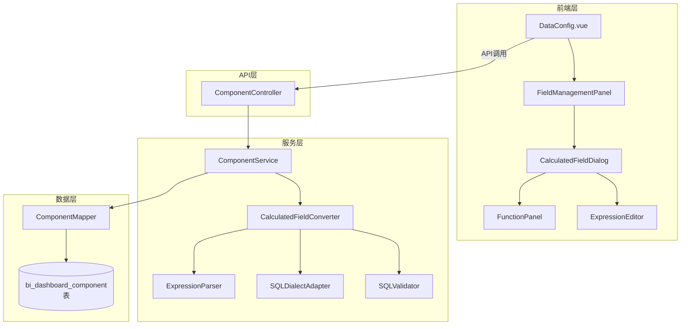

# 设计文档:图表计算字段

## 概述

本设计文档描述了为BI平台数据配置面板添加图表级计算字段功能的技术方案。该功能在现有的数据集级指标配置基础上,增加了图表作用域的临时计算字段,使用户能够为单个图表创建自定义字段,而不影响共享的数据集定义。

### 设计目标

1. **作用域隔离**: 计算字段仅在图表范围内有效,不污染数据集
2. **用户友好**: 提供直观的字段管理界面和表达式构建器
3. **函数支持**: 支持常用SQL函数,降低业务用户使用门槛
4. **安全性**: 复用现有的SQL验证机制,防止注入攻击
5. **生命周期管理**: 计算字段随图表复制/删除而复制/删除

### 核心功能

- **字段管理区**: 分类显示维度字段、指标字段和计算字段
- **计算字段创建**: 基于数据集字段和函数的表达式编辑器
- **函数面板**: 分类的函数库(文本、数值、逻辑、日期函数)
- **表达式验证**: 语法检查和安全验证
- **图表作用域**: 计算字段存储在图表配置中,不写入数据集

### 与现有系统的关系

本功能与 `enhanced-data-config` 规格互补:
- **数据集级指标** (enhanced-data-config): 跨图表共享的聚合指标
- **图表级计算字段** (本规格): 单个图表的临时字段

## 架构

### 系统架构图



### 数据流

1. **配置阶段**: 用户创建计算字段 → 前端验证 → 后端安全验证 → 存储在图表config_json中
2. **执行阶段**: 加载图表 → 解析计算字段 → 转换为SQL → 与数据集字段合并查询
3. **切换数据集**: 检测计算字段 → 警告用户 → 清空计算字段(如果继续)

### 页面布局

```
┌────────────────────────────────────────────────────────────┐
│  数据源配置                                                 │
│  数据源: [ ▼ ]                                             │
│  数据集: [ ▼ ]                                             │
├────────────────────────────────────────────────────────────┤
│ 字段管理               │ 图表配置                          │
│------------------------│-----------------------------------│
│ 维度字段               │ 维度区                            │
│  - 字段1               │  [拖拽区域]                       │
│  - 字段2               │                                   │
│                        │ 指标区                            │
│ 指标字段               │  [拖拽区域]                       │
│  - 字段3               │                                   │
│  - 字段4               │ 过滤区                            │
│                        │  [拖拽区域]                       │
│ 计算字段               │                                   │
│  - fx 计算字段1        │                                   │
│  - fx 计算字段2        │                                   │
│  [+ 新建计算字段]      │                                   │
│                        │                                   │
├────────────────────────────────────────────────────────────┤
│        [ 刷新数据 ]     [ 预览数据 ]                       │
└────────────────────────────────────────────────────────────┘
```

### 实际案例:配置不良贷款率

基于 `t_cbis_t_daikuan_hzwdb` 表配置"某机构某日期的不良贷款率":

#### 步骤1: 选择数据源和数据集
- 数据源: 选择包含该表的数据源
- 数据集: 选择基于 `t_cbis_t_daikuan_hzwdb` 的数据集

#### 步骤2: 字段管理区自动显示(中文)
**维度字段** (显示comment):
- 数据报送机构id
- 数据加载日期
- 区域代码
- 五级分类

**指标字段** (显示comment):
- 借款余额
- 借款金额
- 借款笔数

**说明**: 所有字段显示中文comment,鼠标悬停时显示英文字段名(如: "借款余额 → jkye")

#### 步骤3: 创建计算字段 - 不良贷款余额(可选)
点击"+ 新建计算字段":
1. 字段名称: `npl_balance` (自动生成或手动输入)
2. 字段别名: `不良贷款余额`
3. 字段类型: `指标`
4. 构建表达式:
   - 点击"显示函数"展开函数面板
   - 点击CASE函数,插入模板: `CASE WHEN {condition} THEN {value} ELSE {default} END`
   - 修改为: `CASE WHEN wjfl IN ('次级', '可疑', '损失') THEN jkye ELSE 0 END`
   - 或者简化为: 点击字段列表中的"借款余额",插入`jkye`
5. 聚合方式: `SUM`
6. 点击"验证"确认表达式有效
7. 保存

#### 步骤4: 创建计算字段 - 不良贷款率
点击"+ 新建计算字段":
1. 字段名称: `npl_ratio`
2. 字段别名: `不良贷款率(%)`
3. 字段类型: `指标`
4. 构建表达式(简化方式):
   - 点击字段列表中的"借款余额",插入`jkye`
   - 点击运算符`/`
   - 输入`1000000`
   - 最终表达式: `jkye / 1000000`
5. 或者使用完整表达式(高级方式):
   - 使用CASE函数构建条件求和
   - 表达式: `(SUM(CASE WHEN wjfl IN ('次级', '可疑', '损失') THEN jkye ELSE 0 END) / NULLIF(SUM(jkye), 0)) * 100`
6. 聚合方式: `AUTO` (因为表达式已包含聚合)
7. 保存

#### 步骤5: 配置图表
**维度区**: 
- 从字段管理区拖入"数据报送机构id"
- 从字段管理区拖入"数据加载日期"

**指标区**: 
- 从计算字段区拖入"不良贷款率(%)"

**过滤区**: 
- 添加过滤条件: `load_date = '2025-01-20'`

#### 步骤6: 刷新数据
点击"刷新数据"按钮,图表显示各机构在2025-01-20的不良贷款率。

### 设计优势

1. **降低门槛**: 用户通过点击字段列表插入字段,无需记忆字段名
2. **中文友好**: 字段列表显示中文comment,业务用户易于理解
3. **渐进式复杂度**: 
   - 简单场景: 只用字段和运算符
   - 复杂场景: 展开函数面板使用CASE等高级函数
4. **实时验证**: 输入时即时验证,减少错误
5. **作用域隔离**: 不同图表可以有不同的计算逻辑,互不干扰

## 组件和接口

### 前端核心组件

#### 1. FieldManagementPanel.vue (新增)

字段管理面板组件,负责:
- 显示三类字段:维度字段、指标字段、计算字段
- **所有字段显示中文comment**: "借款余额" (不显示英文字段名)
- 提供"新建计算字段"按钮
- 支持字段拖拽到图表配置区
- 显示计算字段的"fx"图标标识

**显示规则**:
- **维度字段**: 显示 `field.comment` (如: "数据报送机构id")
- **指标字段**: 显示 `field.comment` (如: "借款余额")
- **计算字段**: 显示 `field.alias` (如: "不良贷款率(%)")
- **悬停提示**: 鼠标悬停时显示英文字段名 (如: "jkye")

**Props**:
```javascript
{
  datasetId: Number,
  datasetFields: Array,  // 数据集字段列表(包含name和comment)
  calculatedFields: Array,  // 计算字段列表
  chartType: String  // 图表类型,用于判断是否需要维度
}
```

**Events**:
```javascript
{
  'add-calculated-field': void,  // 点击新建计算字段
  'edit-calculated-field': (field) => void,  // 编辑计算字段
  'delete-calculated-field': (field) => void,  // 删除计算字段
  'field-drag-start': (field, type) => void  // 字段拖拽开始
}
```

**UI示例**:
```
┌─────────────────────────┐
│ 字段管理                │
│                         │
│ 维度字段                │
│  - 数据报送机构id       │  ← 显示comment
│  - 数据加载日期         │
│  - 五级分类             │
│                         │
│ 指标字段                │
│  - 借款余额             │  ← 显示comment
│  - 借款金额             │
│  - 借款笔数             │
│                         │
│ 计算字段                │
│  - fx 不良贷款余额      │  ← 显示alias
│  - fx 不良贷款率(%)     │
│  [+ 新建计算字段]       │
└─────────────────────────┘
```

#### 2. CalculatedFieldDialog.vue (新增)

计算字段配置对话框,包含:
- 字段名称输入
- 字段别名输入
- 字段类型选择(维度/指标)
- 表达式编辑器(支持点击字段插入,显示中文名称)
- 可用字段列表(显示中文comment,点击插入字段名)
- 函数面板(可选,用于高级用户)
- 运算符按钮
- 聚合方式选择(仅指标类型)
- 表达式预览和验证

**设计理念**:
- **简化输入**: 用户通过点击字段列表插入字段,而不是手写字段名
- **中文显示**: 字段列表显示中文comment,降低使用门槛
- **可选高级功能**: 函数面板默认折叠,高级用户可展开使用

**Props**:
```javascript
{
  visible: Boolean,
  field: Object,  // 编辑模式下的字段对象
  datasetFields: Array,  // 可用的数据集字段(包含name和comment)
  existingFields: Array  // 已存在的计算字段(用于名称重复检查)
}
```

**Data Structure**:
```javascript
{
  form: {
    name: '',  // 字段名称(英文标识符,必填)
    alias: '',  // 字段别名(中文名称,必填)
    fieldType: 'dimension',  // 'dimension' | 'metric'
    expression: '',  // 表达式(包含字段名,不是中文)
    aggregation: 'AUTO'  // 聚合方式: AUTO, SUM, AVG, MAX, MIN, COUNT
  },
  // UI状态
  showFunctionPanel: false,  // 是否显示函数面板
  functionType: 'builtin',  // 'builtin' | 'native' - 函数类型
  cursorPosition: 0  // 光标位置,用于插入字段
}
```

**表单字段**:
1. **英文名称** (必填): 
   - 输入框,用于输入字段的英文标识符
   - 验证规则: 只能包含字母、数字和下划线,必须以字母或下划线开头
   - 示例: `npl_ratio`

2. **中文名称** (必填):
   - 输入框,用于输入字段的中文显示名称
   - 示例: `不良贷款率(%)`

3. **字段类型** (必填):
   - 单选: 维度 / 指标

4. **表达式编辑器** (必填):
   - 多行文本框
   - 左侧: 可用字段列表(显示中文)
   - 右侧: 函数面板(可折叠)

5. **聚合方式** (仅指标类型):
   - 下拉选择: 自动、SUM、AVG、MAX、MIN、COUNT

**字段插入逻辑**:
```javascript
// 用户点击字段列表中的"借款余额(jkye)"
insertField(field) {
  // 在光标位置插入字段名(不是中文)
  const before = this.form.expression.substring(0, this.cursorPosition)
  const after = this.form.expression.substring(this.cursorPosition)
  this.form.expression = before + field.name + after
  this.cursorPosition += field.name.length
}
```

#### 3. ExpressionEditor.vue (新增)

表达式编辑器组件,提供:
- 多行文本输入框
- 可用字段列表(左侧面板,显示中文comment)
- 运算符按钮(+, -, *, /, (, ))
- 函数面板(可折叠,默认隐藏)
- 实时语法验证
- 光标位置跟踪

**核心功能**:
1. **字段列表**: 
   - 显示格式: "借款余额 (jkye)"
   - 点击后插入字段名: `jkye`
   - 分类显示: 维度字段、指标字段

2. **运算符按钮**: 
   - 点击插入到光标位置
   - 常用运算符: +, -, *, /, (, )

3. **函数面板** (可选,默认折叠):
   - 点击"显示函数"按钮展开
   - 提供常用函数模板
   - 适合高级用户

**UI布局**:
```
┌─────────────────────────────────────────────┐
│ 可用字段 (显示中文comment)                   │
│ ┌─────────────────────────────────────────┐ │
│ │ 维度字段                                 │ │
│ │  - 数据报送机构id                        │ │  ← 显示comment
│ │  - 数据加载日期                          │ │
│ │  - 五级分类                              │ │
│ │                                          │ │
│ │ 指标字段                                 │ │
│ │  - 借款余额                              │ │  ← 显示comment
│ │  - 借款金额                              │ │
│ └─────────────────────────────────────────┘ │
│                                              │
│ 表达式 (使用英文字段名)                      │
│ ┌─────────────────────────────────────────┐ │
│ │ jkye / 1000000                          │ │  ← 存储英文名
│ │                                          │ │
│ └─────────────────────────────────────────┘ │
│                                              │
│ 运算符: [+] [-] [*] [/] [(] [)]            │
│ [显示函数 ▼]                                │
│                                              │
│ 实时验证: ✓ 表达式有效                      │
│                                              │
│ 说明: 点击字段名插入到表达式中               │
└─────────────────────────────────────────────┘
```

**字段显示与存储**:
- **显示**: 用户看到中文comment "借款余额"
- **插入**: 点击后插入英文字段名 `jkye` 到表达式
- **存储**: 表达式中存储英文字段名 `jkye`
- **悬停**: 鼠标悬停显示完整信息 "借款余额 (jkye)"

**Features**:
- 点击字段名插入到光标位置
- 运算符按钮快速插入
- 实时显示验证结果
- 支持撤销/重做(浏览器原生)

#### 4. FunctionPanel.vue (新增)

函数面板组件(可折叠,默认隐藏),提供:
- **系统内置函数**: 数据库无关,BI系统提供
- **数据库函数**: 数据库原生函数,根据数据源类型动态显示
- 函数语法提示和示例
- 函数模板插入

**设计理念**:
- **可选功能**: 默认折叠,不干扰普通用户
- **双函数体系**: 
  - 系统内置函数: 屏蔽数据库差异,适用于所有数据源
  - 数据库函数: 利用特定数据库的高级功能
- **智能切换**: 根据当前数据源类型显示对应的数据库函数

**Function Categories**:

**1. 系统内置函数** (database-agnostic):
```javascript
{
  builtin: {
    logical: [
      { 
        name: 'CASE', 
        syntax: 'CASE WHEN {condition} THEN {value} ELSE {default} END', 
        desc: '条件判断(系统内置)',
        example: 'CASE WHEN wjfl IN (\'次级\', \'可疑\', \'损失\') THEN jkye ELSE 0 END',
        type: 'builtin'
      },
      { 
        name: 'IF', 
        syntax: 'IF({condition}, {true_value}, {false_value})', 
        desc: '简单条件(系统内置)',
        example: 'IF(jkye > 1000000, \'大额\', \'小额\')',
        type: 'builtin'
      },
      {
        name: 'COALESCE',
        syntax: 'COALESCE({val1}, {val2}, ...)',
        desc: '返回第一个非NULL值(系统内置)',
        example: 'COALESCE(jkye, 0)',
        type: 'builtin'
      }
    ],
    numeric: [
      { 
        name: 'ROUND', 
        syntax: 'ROUND({number}, {decimals})', 
        desc: '四舍五入(系统内置)',
        example: 'ROUND(jkye / 1000000, 2)',
        type: 'builtin'
      },
      { 
        name: 'ABS', 
        syntax: 'ABS({number})', 
        desc: '绝对值(系统内置)',
        example: 'ABS(jkye)',
        type: 'builtin'
      },
      {
        name: 'FLOOR',
        syntax: 'FLOOR({number})',
        desc: '向下取整(系统内置)',
        example: 'FLOOR(jkye / 1000000)',
        type: 'builtin'
      },
      {
        name: 'CEIL',
        syntax: 'CEIL({number})',
        desc: '向上取整(系统内置)',
        example: 'CEIL(jkye / 1000000)',
        type: 'builtin'
      }
    ],
    text: [
      { 
        name: 'CONCAT', 
        syntax: 'CONCAT({str1}, {str2}, ...)', 
        desc: '连接字符串(系统内置)',
        example: 'CONCAT(sjbsjgid, \'-\', load_date)',
        type: 'builtin'
      },
      {
        name: 'SUBSTRING',
        syntax: 'SUBSTRING({str}, {start}, {length})',
        desc: '提取子字符串(系统内置)',
        example: 'SUBSTRING(sjbsjgid, 1, 4)',
        type: 'builtin'
      },
      {
        name: 'LENGTH',
        syntax: 'LENGTH({str})',
        desc: '字符串长度(系统内置)',
        example: 'LENGTH(sjbsjgid)',
        type: 'builtin'
      }
    ],
    date: [
      {
        name: 'YEAR',
        syntax: 'YEAR({date})',
        desc: '提取年份(系统内置)',
        example: 'YEAR(load_date)',
        type: 'builtin'
      },
      {
        name: 'MONTH',
        syntax: 'MONTH({date})',
        desc: '提取月份(系统内置)',
        example: 'MONTH(load_date)',
        type: 'builtin'
      },
      {
        name: 'DAY',
        syntax: 'DAY({date})',
        desc: '提取日期(系统内置)',
        example: 'DAY(load_date)',
        type: 'builtin'
      }
    ]
  }
}
```

**2. 数据库函数** (database-specific):
```javascript
{
  // MySQL特有函数
  mysql: {
    text: [
      {
        name: 'GROUP_CONCAT',
        syntax: 'GROUP_CONCAT({column} SEPARATOR {sep})',
        desc: '分组连接(MySQL)',
        example: 'GROUP_CONCAT(sjbsjgid SEPARATOR \',\')',
        type: 'native',
        database: 'MySQL'
      }
    ],
    date: [
      {
        name: 'DATE_FORMAT',
        syntax: 'DATE_FORMAT({date}, {format})',
        desc: '格式化日期(MySQL)',
        example: 'DATE_FORMAT(load_date, \'%Y-%m\')',
        type: 'native',
        database: 'MySQL'
      }
    ]
  },
  // PostgreSQL特有函数
  postgresql: {
    text: [
      {
        name: 'STRING_AGG',
        syntax: 'STRING_AGG({column}, {sep})',
        desc: '分组连接(PostgreSQL)',
        example: 'STRING_AGG(sjbsjgid, \',\')',
        type: 'native',
        database: 'PostgreSQL'
      }
    ]
  },
  // ClickHouse特有函数
  clickhouse: {
    text: [
      {
        name: 'groupArray',
        syntax: 'groupArray({column})',
        desc: '分组数组(ClickHouse)',
        example: 'groupArray(sjbsjgid)',
        type: 'native',
        database: 'ClickHouse'
      }
    ]
  }
}
```

**UI布局**:
```
┌─────────────────────────────────────────────┐
│ 函数面板                                     │
│                                              │
│ [系统内置函数] [数据库函数(MySQL)]          │  ← 标签切换
│                                              │
│ 逻辑函数                                     │
│  - CASE: 条件判断                           │
│  - IF: 简单条件                             │
│  - COALESCE: 返回第一个非NULL值             │
│                                              │
│ 数值函数                                     │
│  - ROUND: 四舍五入                          │
│  - ABS: 绝对值                              │
│  - FLOOR: 向下取整                          │
│                                              │
│ 文本函数                                     │
│  - CONCAT: 连接字符串                       │
│  - SUBSTRING: 提取子字符串                  │
│                                              │
│ 日期函数                                     │
│  - YEAR: 提取年份                           │
│  - MONTH: 提取月份                          │
│                                              │
│ [查看函数文档]                              │
└─────────────────────────────────────────────┘
```

**插入逻辑**:
```javascript
// 用户点击CASE函数
insertFunction(func) {
  const template = func.syntax
  // 在光标位置插入模板
  this.$emit('insert-text', template)
  
  // 如果是数据库函数,添加提示
  if (func.type === 'native') {
    this.$message.info(`已插入${func.database}函数: ${func.name}`)
  }
}
```

**函数转换**:
- **系统内置函数**: 后端CalculatedFieldConverter根据目标数据库类型转换为对应SQL
- **数据库函数**: 直接传递给目标数据库执行,不做转换

### 后端核心组件

#### 1. CalculatedFieldDTO.java (新增)

计算字段配置的数据传输对象:

```java
public class CalculatedFieldDTO {
    private String name;  // 字段名称
    private String alias;  // 字段别名
    private String fieldType;  // 'dimension' | 'metric'
    private String expression;  // 表达式
    private String aggregation;  // 聚合方式(仅指标类型)
}
```

#### 2. CalculatedFieldConverter.java (新增)

计算字段转换器,负责将计算字段转换为SQL:

```java
@Component
public class CalculatedFieldConverter {
    
    @Autowired
    private SQLValidator sqlValidator;
    
    @Autowired
    private ExpressionParser expressionParser;
    
    @Autowired
    private SQLDialectAdapter dialectAdapter;
    
    @Autowired
    private BuiltinFunctionConverter builtinFunctionConverter;
    
    /**
     * 转换计算字段为SQL表达式
     * 
     * @param field 计算字段配置
     * @param datasetFields 数据集字段列表
     * @param dbType 数据库类型
     * @return SQL表达式
     */
    public String convertToSQL(
        CalculatedFieldDTO field,
        List<DatasetField> datasetFields,
        String dbType
    ) {
        // 1. 验证表达式
        sqlValidator.validateExpression(field.getExpression());
        
        // 2. 验证字段引用
        Set<String> referencedFields = expressionParser.extractFieldReferences(field.getExpression());
        validateFieldReferences(referencedFields, datasetFields);
        
        // 3. 提取函数调用
        Set<String> functions = expressionParser.extractFunctions(field.getExpression());
        
        // 4. 区分系统内置函数和数据库函数
        Map<String, String> builtinFunctions = new HashMap<>();
        Set<String> nativeFunctions = new HashSet<>();
        
        for (String func : functions) {
            if (builtinFunctionConverter.isBuiltinFunction(func)) {
                builtinFunctions.put(func, func);
            } else {
                nativeFunctions.add(func);
            }
        }
        
        // 5. 转换系统内置函数为目标数据库SQL
        String sql = field.getExpression();
        for (String builtinFunc : builtinFunctions.keySet()) {
            sql = builtinFunctionConverter.convertFunction(sql, builtinFunc, dbType);
        }
        
        // 6. 验证数据库函数
        validateNativeFunctions(nativeFunctions, dbType);
        
        // 7. 应用聚合(如果是指标类型)
        if ("metric".equals(field.getFieldType()) && !"AUTO".equals(field.getAggregation())) {
            sql = field.getAggregation() + "(" + sql + ")";
        }
        
        // 8. 添加别名
        sql = sql + " AS " + field.getName();
        
        // 9. 方言适配(处理特殊语法)
        sql = dialectAdapter.adaptSQL(sql, dbType);
        
        return sql;
    }
    
    /**
     * 验证字段引用
     */
    private void validateFieldReferences(
        Set<String> referencedFields,
        List<DatasetField> datasetFields
    ) {
        Set<String> availableFields = datasetFields.stream()
            .map(DatasetField::getName)
            .collect(Collectors.toSet());
            
        for (String field : referencedFields) {
            if (!availableFields.contains(field)) {
                throw new IllegalArgumentException("引用的字段不存在: " + field);
            }
        }
    }
    
    /**
     * 验证数据库函数
     */
    private void validateNativeFunctions(Set<String> functions, String dbType) {
        // 数据库函数不做严格验证,由数据库执行时报错
        // 但可以提供警告信息
        if (!functions.isEmpty()) {
            log.warn("表达式包含数据库原生函数: {}, 数据库类型: {}", functions, dbType);
        }
    }
}
```

#### 3. BuiltinFunctionConverter.java (新增)

系统内置函数转换器,负责将内置函数转换为目标数据库SQL:

```java
@Component
public class BuiltinFunctionConverter {
    
    // 系统内置函数列表
    private static final Set<String> BUILTIN_FUNCTIONS = Set.of(
        // 逻辑函数
        "CASE", "IF", "COALESCE", "NULLIF",
        // 数值函数
        "ROUND", "FLOOR", "CEIL", "ABS", "MOD", "POWER",
        // 文本函数
        "CONCAT", "SUBSTRING", "LENGTH", "UPPER", "LOWER", "TRIM",
        // 日期函数
        "YEAR", "MONTH", "DAY", "DATEDIFF"
    );
    
    /**
     * 判断是否为系统内置函数
     */
    public boolean isBuiltinFunction(String functionName) {
        return BUILTIN_FUNCTIONS.contains(functionName.toUpperCase());
    }
    
    /**
     * 转换系统内置函数为目标数据库SQL
     */
    public String convertFunction(String expression, String functionName, String dbType) {
        String upperFunc = functionName.toUpperCase();
        
        switch (upperFunc) {
            case "IF":
                return convertIfFunction(expression, dbType);
            case "CONCAT":
                return convertConcatFunction(expression, dbType);
            case "SUBSTRING":
                return convertSubstringFunction(expression, dbType);
            case "DATEDIFF":
                return convertDateDiffFunction(expression, dbType);
            // 其他函数大多数数据库语法一致,不需要转换
            default:
                return expression;
        }
    }
    
    /**
     * 转换IF函数
     * MySQL: IF(condition, true_val, false_val)
     * PostgreSQL: CASE WHEN condition THEN true_val ELSE false_val END
     */
    private String convertIfFunction(String expression, String dbType) {
        if ("PostgreSQL".equalsIgnoreCase(dbType)) {
            // 将IF(cond, val1, val2)转换为CASE WHEN cond THEN val1 ELSE val2 END
            Pattern pattern = Pattern.compile("IF\\s*\\(([^,]+),([^,]+),([^)]+)\\)", Pattern.CASE_INSENSITIVE);
            Matcher matcher = pattern.matcher(expression);
            
            StringBuffer sb = new StringBuffer();
            while (matcher.find()) {
                String condition = matcher.group(1).trim();
                String trueVal = matcher.group(2).trim();
                String falseVal = matcher.group(3).trim();
                String replacement = String.format("CASE WHEN %s THEN %s ELSE %s END", condition, trueVal, falseVal);
                matcher.appendReplacement(sb, Matcher.quoteReplacement(replacement));
            }
            matcher.appendTail(sb);
            return sb.toString();
        }
        return expression;
    }
    
    /**
     * 转换CONCAT函数
     * MySQL: CONCAT(str1, str2, ...)
     * PostgreSQL: str1 || str2 || ...
     */
    private String convertConcatFunction(String expression, String dbType) {
        if ("PostgreSQL".equalsIgnoreCase(dbType)) {
            // 将CONCAT(a, b, c)转换为a || b || c
            Pattern pattern = Pattern.compile("CONCAT\\s*\\(([^)]+)\\)", Pattern.CASE_INSENSITIVE);
            Matcher matcher = pattern.matcher(expression);
            
            StringBuffer sb = new StringBuffer();
            while (matcher.find()) {
                String args = matcher.group(1);
                String replacement = args.replaceAll(",", " || ");
                matcher.appendReplacement(sb, Matcher.quoteReplacement(replacement));
            }
            matcher.appendTail(sb);
            return sb.toString();
        }
        return expression;
    }
    
    /**
     * 转换SUBSTRING函数
     * MySQL: SUBSTRING(str, pos, len)
     * PostgreSQL: SUBSTRING(str FROM pos FOR len)
     */
    private String convertSubstringFunction(String expression, String dbType) {
        if ("PostgreSQL".equalsIgnoreCase(dbType)) {
            Pattern pattern = Pattern.compile("SUBSTRING\\s*\\(([^,]+),([^,]+),([^)]+)\\)", Pattern.CASE_INSENSITIVE);
            Matcher matcher = pattern.matcher(expression);
            
            StringBuffer sb = new StringBuffer();
            while (matcher.find()) {
                String str = matcher.group(1).trim();
                String pos = matcher.group(2).trim();
                String len = matcher.group(3).trim();
                String replacement = String.format("SUBSTRING(%s FROM %s FOR %s)", str, pos, len);
                matcher.appendReplacement(sb, Matcher.quoteReplacement(replacement));
            }
            matcher.appendTail(sb);
            return sb.toString();
        }
        return expression;
    }
    
    /**
     * 转换DATEDIFF函数
     * MySQL: DATEDIFF(date1, date2) - 返回天数差
     * PostgreSQL: (date1 - date2) - 返回interval,需要提取天数
     */
    private String convertDateDiffFunction(String expression, String dbType) {
        if ("PostgreSQL".equalsIgnoreCase(dbType)) {
            Pattern pattern = Pattern.compile("DATEDIFF\\s*\\(([^,]+),([^)]+)\\)", Pattern.CASE_INSENSITIVE);
            Matcher matcher = pattern.matcher(expression);
            
            StringBuffer sb = new StringBuffer();
            while (matcher.find()) {
                String date1 = matcher.group(1).trim();
                String date2 = matcher.group(2).trim();
                String replacement = String.format("EXTRACT(DAY FROM (%s - %s))", date1, date2);
                matcher.appendReplacement(sb, Matcher.quoteReplacement(replacement));
            }
            matcher.appendTail(sb);
            return sb.toString();
        }
        return expression;
    }
}
```

#### 3. ExpressionParser.java (增强)

增强现有的ExpressionParser,添加:

```java
/**
 * 提取表达式中的字段引用
 * 字段引用格式: {field_name} 或直接使用字段名
 */
public Set<String> extractFieldReferences(String expression);

/**
 * 提取表达式中的函数调用
 */
public Set<String> extractFunctions(String expression);

/**
 * 验证函数语法
 */
public void validateFunctionSyntax(String expression);
```

### API接口

#### 1. 验证计算字段

```
POST /api/bi/component/calculated-field/validate
Request: {
  datasetId: Long,
  field: CalculatedFieldDTO
}
Response: {
  valid: boolean,
  message: string,
  sqlPreview: string
}
```

#### 2. 测试计算字段

```
POST /api/bi/component/calculated-field/test
Request: {
  datasetId: Long,
  field: CalculatedFieldDTO
}
Response: {
  success: boolean,
  data: [],
  columns: [],
  duration: number
}
```

#### 3. 保存图表配置(包含计算字段)

```
PUT /api/bi/component/{id}
Request: {
  configJson: {
    dataConfig: {
      datasetId: Long,
      dimensions: [],
      metrics: [],
      calculatedFields: [CalculatedFieldDTO]
    }
  }
}
Response: AjaxResult
```

## 数据模型

### 数据库模式

计算字段存储在 `bi_dashboard_component` 表的 `config_json` 字段中。

```sql
-- 现有表结构,无需修改
CREATE TABLE bi_dashboard_component (
    id BIGINT PRIMARY KEY AUTO_INCREMENT,
    dashboard_id BIGINT NOT NULL,
    component_type VARCHAR(50) NOT NULL,
    config_json TEXT COMMENT '组件配置(JSON)',
    position_json TEXT COMMENT '位置配置(JSON)',
    create_time DATETIME DEFAULT CURRENT_TIMESTAMP,
    update_time DATETIME DEFAULT CURRENT_TIMESTAMP ON UPDATE CURRENT_TIMESTAMP
);
```

### JSON配置结构

```json
{
  "dataConfig": {
    "datasourceId": 1,
    "datasetId": 10,
    "dimensions": [
      { "fieldName": "region", "comment": "地区" }
    ],
    "metrics": [
      { "fieldName": "amount", "comment": "金额" }
    ],
    "calculatedFields": [
      {
        "name": "amount_in_million",
        "alias": "金额(百万)",
        "fieldType": "metric",
        "expression": "amount / 1000000",
        "aggregation": "SUM"
      },
      {
        "name": "risk_level",
        "alias": "风险等级",
        "fieldType": "dimension",
        "expression": "CASE WHEN npl_ratio > 0.05 THEN '高风险' WHEN npl_ratio > 0.02 THEN '中风险' ELSE '低风险' END",
        "aggregation": "AUTO"
      }
    ],
    "filters": []
  }
}
```

## 正确性属性

*属性是一个特征或行为,应该在系统的所有有效执行中保持为真——本质上是关于系统应该做什么的形式化陈述。*


### 属性反思

经过分析,我将相似的验收标准合并为核心属性:

**合并策略**:
1. 作用域隔离(3.1-3.5) → 属性1
2. 表达式验证(7.1-7.6) → 属性2
3. 函数支持(10.1-10.4) → 属性3
4. 生命周期管理(5.1-5.5) → 属性4
5. 持久化Round-trip(11.3+11.4) → 属性5
6. SQL生成(4.2, 4.3, 4.4) → 属性6
7. 字段引用验证(7.1) → 已包含在属性2中
8. 函数参数验证(7.5, 10.7) → 属性7

### 核心属性

#### 属性 1: 作用域隔离

*对于任意*图表和计算字段,计算字段应该仅存储在该图表的config_json中,不应该写入数据集表,也不应该对其他图表可见

**验证需求**: 3.1, 3.2, 3.3, 3.4, 3.5

#### 属性 2: 表达式验证完整性

*对于任意*表达式输入,系统应该验证:字段引用存在性、运算符合法性、括号匹配、SQL注入模式,并在验证失败时返回具体错误消息

**验证需求**: 7.1, 7.2, 7.4, 7.6, 7.7

#### 属性 3: 函数支持完整性

*对于任意*支持的函数(文本/数值/逻辑/日期),系统应该能够验证其语法并转换为目标数据库的SQL方言

**验证需求**: 10.1, 10.2, 10.3, 10.4, 10.5

#### 属性 4: 生命周期一致性

*对于任意*图表操作(复制/删除/导出/导入),计算字段应该随图表一起复制/删除/导出/导入,保持引用完整性

**验证需求**: 5.1, 5.2, 5.3, 5.4, 5.5

#### 属性 5: 持久化Round-trip

*对于任意*有效的计算字段配置,序列化为JSON后再反序列化,应该得到等价的配置对象

**验证需求**: 11.3, 11.4

#### 属性 6: SQL生成正确性

*对于任意*计算字段,系统应该生成正确的SQL表达式,包括表达式转换、聚合应用(如果是指标类型)、别名添加

**验证需求**: 4.2, 4.3, 4.4

#### 属性 7: 函数参数验证

*对于任意*函数调用,系统应该验证参数数量和类型是否符合函数签名

**验证需求**: 7.5, 10.7

#### 属性 8: 字段加载隔离

*对于任意*数据集,加载时应该显示数据集字段和当前图表的计算字段,不应该显示其他图表的计算字段

**验证需求**: 1.3, 1.4

#### 属性 9: 保存后状态更新

*对于任意*有效的计算字段,保存后应该立即出现在字段管理区的计算字段列表中

**验证需求**: 2.9

#### 属性 10: 更新和删除行为

*对于任意*计算字段,更新应该修改配置,删除应该从配置和UI中移除

**验证需求**: 8.3, 8.5

#### 属性 11: 数据集切换清空

*对于任意*包含计算字段的图表,切换数据集时应该清空所有计算字段

**验证需求**: 6.5

#### 属性 12: 向后兼容性

*对于任意*不包含calculatedFields字段的旧版本图表配置,系统应该能够正常加载并将calculatedFields视为空数组

**验证需求**: 11.5

## 错误处理

### 错误类型

1. **验证错误**: 
   - 字段引用不存在 → 400 Bad Request + "引用的字段不存在: {field_name}"
   - 表达式语法错误 → 400 + "表达式语法错误: {具体错误}"
   - 括号不匹配 → 400 + "括号不匹配"
   - 不支持的运算符 → 400 + "不支持的运算符: {operator}"
   - 不支持的函数 → 400 + "不支持的函数: {function_name}"

2. **安全错误**: 
   - SQL注入尝试 → 403 Forbidden + "表达式包含不安全的SQL模式" + 记录日志

3. **命名冲突错误**: 
   - 字段名重复 → 400 + "字段名已存在: {field_name}"
   - 字段名格式错误 → 400 + "字段名只能包含字母、数字和下划线"

4. **依赖错误**: 
   - 删除被使用的字段 → 警告对话框 + 列出依赖位置

5. **数据库兼容性错误**: 
   - 函数不支持 → 400 + "函数 {function_name} 在 {db_type} 中不支持"

6. **执行错误**: 
   - SQL执行失败 → 500 + 错误详情 + SQL预览(测试模式)

### 错误恢复机制

1. **自动修复建议**: 
   - 字段引用错误 → 显示可用字段列表
   - 函数参数错误 → 显示正确的函数签名

2. **部分保存**: 
   - 如果部分计算字段有效,允许保存有效的字段

3. **配置回滚**: 
   - 保存失败时保留上一个有效配置

## 测试策略

### 双重测试方法

- **单元测试**: 特定示例、边界情况、错误条件、UI交互
- **属性测试**: 通过随机输入验证通用属性(每个属性最少100次迭代)

### 测试库选择

- **后端**: JUnit 5 + jqwik (属性测试)
- **前端**: Jest + @testing-library/vue (单元测试) + fast-check (属性测试)

### 测试覆盖范围

#### 后端测试

1. **CalculatedFieldConverter**: 
   - 属性测试: SQL生成正确性(属性6)
   - 单元测试: 特定函数转换、聚合应用、方言适配

2. **ExpressionParser** (增强):
   - 属性测试: 字段引用提取、函数提取、括号匹配(属性2)
   - 单元测试: 复杂嵌套表达式、边界情况

3. **SQLValidator** (复用):
   - 属性测试: SQL注入防护、表达式验证(属性2)
   - 单元测试: 特定注入模式、函数参数验证(属性7)

4. **持久化**:
   - 属性测试: Round-trip序列化(属性5)
   - 单元测试: 向后兼容性(属性12)

5. **作用域隔离**:
   - 属性测试: 存储位置、加载隔离(属性1, 属性8)
   - 单元测试: 多图表场景

6. **生命周期**:
   - 属性测试: 复制/删除/导出/导入(属性4)
   - 单元测试: 引用完整性

#### 前端测试

1. **FieldManagementPanel.vue**:
   - 单元测试: 字段分类显示、拖拽功能、按钮交互

2. **CalculatedFieldDialog.vue**:
   - 单元测试: 表单验证、函数插入、字段插入、错误显示
   - 集成测试: 完整的创建/编辑/删除流程

3. **ExpressionEditor.vue**:
   - 单元测试: 光标位置插入、语法高亮、实时验证

4. **FunctionPanel.vue**:
   - 单元测试: 函数分类显示、函数插入、语法提示

5. **DataConfig.vue** (增强):
   - 单元测试: 数据集切换警告、计算字段管理、状态更新
   - 集成测试: 与图表配置区的交互

#### 集成测试

1. **端到端流程**:
   - 创建计算字段 → 拖拽到图表配置 → 保存 → 刷新数据 → 验证结果
   - 复制图表 → 验证计算字段被复制
   - 切换数据集 → 验证警告和清空

2. **多图表场景**:
   - 创建两个图表,各自添加计算字段 → 验证作用域隔离

3. **错误处理**:
   - 输入无效表达式 → 验证错误提示
   - 尝试SQL注入 → 验证被拦截

### 属性测试示例

```java
@Property(tries = 100)
@Label("Feature: chart-calculated-fields, Property 1: 作用域隔离")
void calculatedFieldScopeIsolation(
    @ForAll("validChartConfig") ChartConfig chart1,
    @ForAll("validChartConfig") ChartConfig chart2,
    @ForAll("validCalculatedField") CalculatedFieldDTO field
) {
    // 为chart1添加计算字段
    chart1.addCalculatedField(field);
    componentService.save(chart1);
    
    // 加载chart2
    ChartConfig loadedChart2 = componentService.load(chart2.getId());
    
    // 验证chart2不包含chart1的计算字段
    assertFalse(loadedChart2.getCalculatedFields().contains(field));
}

@Property(tries = 100)
@Label("Feature: chart-calculated-fields, Property 2: 表达式验证完整性")
void expressionValidation(@ForAll("invalidExpressions") String expression) {
    assertThrows(ValidationException.class, () -> {
        sqlValidator.validateExpression(expression);
    });
}

@Provide
Arbitrary<String> invalidExpressions() {
    return Arbitraries.of(
        "field1 +",  // 运算符后缺少操作数
        "field1 + (field2",  // 括号不匹配
        "field1; DROP TABLE",  // SQL注入
        "field1 + nonexistent_field",  // 字段不存在
        "UNSUPPORTED_FUNC(field1)"  // 不支持的函数
    );
}

@Property(tries = 100)
@Label("Feature: chart-calculated-fields, Property 5: 持久化Round-trip")
void persistenceRoundTrip(@ForAll("validCalculatedField") CalculatedFieldDTO field) {
    // 序列化
    String json = objectMapper.writeValueAsString(field);
    
    // 反序列化
    CalculatedFieldDTO deserialized = objectMapper.readValue(json, CalculatedFieldDTO.class);
    
    // 验证等价性
    assertEquals(field.getName(), deserialized.getName());
    assertEquals(field.getExpression(), deserialized.getExpression());
    assertEquals(field.getFieldType(), deserialized.getFieldType());
    assertEquals(field.getAggregation(), deserialized.getAggregation());
}
```

### 前端属性测试示例

```javascript
import fc from 'fast-check'

describe('Feature: chart-calculated-fields, Property 6: SQL生成正确性', () => {
  it('should generate correct SQL for any valid calculated field', () => {
    fc.assert(
      fc.property(
        fc.record({
          name: fc.stringMatching(/^[a-zA-Z_][a-zA-Z0-9_]*$/),
          expression: fc.oneof(
            fc.constant('field1 + field2'),
            fc.constant('field1 * 100'),
            fc.constant('ROUND(field1, 2)')
          ),
          fieldType: fc.constantFrom('dimension', 'metric'),
          aggregation: fc.constantFrom('AUTO', 'SUM', 'AVG', 'MAX', 'MIN', 'COUNT')
        }),
        (field) => {
          const sql = convertToSQL(field)
          
          // 验证SQL包含表达式
          expect(sql).toContain(field.expression)
          
          // 验证SQL包含别名
          expect(sql).toContain(`AS ${field.name}`)
          
          // 如果是指标且有聚合,验证包含聚合函数
          if (field.fieldType === 'metric' && field.aggregation !== 'AUTO') {
            expect(sql).toContain(`${field.aggregation}(`)
          }
        }
      ),
      { numRuns: 100 }
    )
  })
})
```

### 安全测试

1. **SQL注入测试套件**: 
   - 使用OWASP测试用例
   - 测试各种注入模式(UNION、注释、终止符等)

2. **模糊测试**: 
   - 随机生成表达式测试健壮性
   - 测试极端输入(超长字符串、特殊字符等)

3. **日志审计**: 
   - 验证安全事件被正确记录
   - 验证敏感信息不被记录

### 性能测试

1. **大量计算字段**: 
   - 测试单个图表包含20+计算字段的性能
   - 验证警告提示

2. **复杂表达式**: 
   - 测试深度嵌套的表达式
   - 测试包含多个函数的表达式

3. **并发测试**: 
   - 多个用户同时编辑不同图表的计算字段
   - 验证作用域隔离

## 实现注意事项

### 前端实现

1. **组件复用**: 
   - 复用现有的MetricConfigDialog的表单验证逻辑
   - 复用现有的拖拽功能

2. **状态管理**: 
   - 计算字段存储在组件的dataConfig中
   - 使用Vuex管理图表级状态

3. **性能优化**: 
   - 表达式验证使用防抖(debounce)
   - 字段列表使用虚拟滚动(如果字段很多)

4. **用户体验**: 
   - 提供快捷键(Ctrl+S保存、Esc关闭对话框)
   - 提供撤销/重做功能
   - 提供表达式模板

### 后端实现

1. **代码复用**: 
   - 复用enhanced-data-config的SQLValidator
   - 复用enhanced-data-config的ExpressionParser
   - 复用enhanced-data-config的SQLDialectAdapter

2. **安全性**: 
   - 所有用户输入必须经过SQLValidator验证
   - 使用白名单机制验证字段名和函数名
   - 记录所有安全事件

3. **性能**: 
   - 限制表达式长度(最大500字符)
   - 限制计算字段数量(建议不超过20个)
   - 使用缓存减少重复验证

4. **兼容性**: 
   - 确保向后兼容(旧版本图表没有calculatedFields字段)
   - 使用Optional处理可能为null的字段

### 数据库考虑

1. **存储**: 
   - 计算字段存储在config_json中,无需修改表结构
   - JSON大小限制:建议不超过64KB

2. **查询**: 
   - 加载图表时一次性加载所有配置
   - 不需要额外的JOIN查询

3. **备份**: 
   - 计算字段随图表配置一起备份
   - 支持配置版本控制(可选)

## 部署和迁移

### 部署步骤

1. **后端部署**: 
   - 部署新的CalculatedFieldConverter类
   - 增强ExpressionParser(添加字段引用和函数提取方法)
   - 添加新的API端点

2. **前端部署**: 
   - 部署新的组件(FieldManagementPanel、CalculatedFieldDialog等)
   - 更新DataConfig.vue
   - 更新路由和权限配置

3. **测试**: 
   - 运行所有单元测试和属性测试
   - 执行集成测试和端到端测试
   - 执行安全测试

4. **灰度发布**: 
   - 先对部分用户开放功能
   - 收集反馈和监控错误
   - 逐步扩大范围

### 数据迁移

**无需数据迁移**: 本功能不修改数据库结构,只在现有的config_json字段中添加新的JSON属性。

### 向后兼容性

1. **旧版本图表**: 
   - 不包含calculatedFields字段的图表正常加载
   - 系统将calculatedFields视为空数组

2. **API兼容**: 
   - 新增的API端点不影响现有API
   - 现有的保存/加载逻辑兼容新的配置结构

## 监控和维护

### 监控指标

1. **使用指标**: 
   - 计算字段创建数量
   - 平均每个图表的计算字段数量
   - 最常用的函数

2. **性能指标**: 
   - 表达式验证耗时
   - SQL生成耗时
   - 查询执行耗时

3. **错误指标**: 
   - 验证失败率
   - SQL注入尝试次数
   - 执行错误率

### 日志记录

1. **操作日志**: 
   - 计算字段创建/编辑/删除
   - 数据集切换(包含计算字段清空)

2. **安全日志**: 
   - SQL注入尝试
   - 验证失败(包含失败原因)

3. **性能日志**: 
   - 慢查询(执行时间>5秒)
   - 复杂表达式(嵌套深度>3)

### 维护任务

1. **定期审查**: 
   - 审查安全日志,识别攻击模式
   - 审查性能日志,优化慢查询
   - 审查使用日志,了解用户需求

2. **功能增强**: 
   - 根据用户反馈添加新函数
   - 优化表达式编辑器体验
   - 添加更多表达式模板

3. **文档更新**: 
   - 更新用户手册
   - 更新API文档
   - 更新函数参考文档
