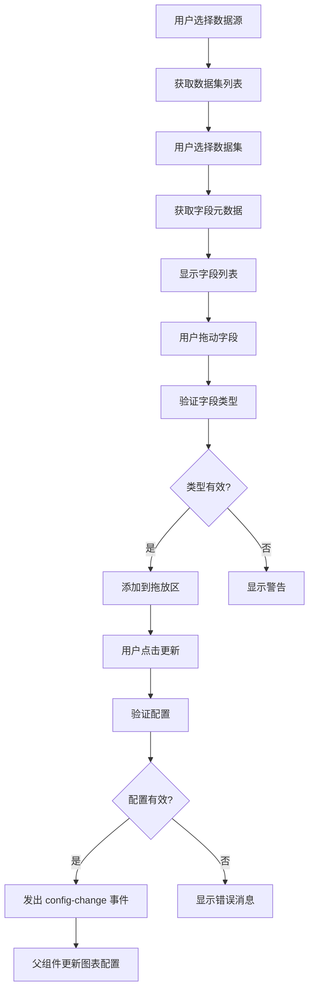

# 设计文档

## 概述

数据配置面板是一个 Vue 2 组件,为 IRAS Smart BI 仪表板设计器提供拖放式数据配置界面。该组件使用户能够通过可视化方式选择数据源、数据集和字段,并将它们组织到指标、维度、过滤器和数量配置区域中。

### 设计目标

1. **直观的用户体验**: 提供清晰的视觉层次和拖放交互
2. **类型安全**: 确保只有有效的字段类型可以放入相应的区域
3. **实时反馈**: 在所有交互过程中提供即时的视觉反馈
4. **可扩展性**: 设计支持未来添加新的配置选项
5. **集成性**: 与现有的仪表板设计器无缝集成

### 技术栈

- **前端框架**: Vue 2.6.12
- **UI 组件库**: Element UI 2.15.14
- **拖放库**: Sortable.js 1.10.2
- **状态管理**: Vuex (用于与设计器通信)
- **HTTP 客户端**: Axios 0.28.1

## 架构

### 组件层次结构

```
DataConfigPanel (主容器)
├── ConfigArea (左侧配置区域)
│   ├── DropZone (指标区)
│   ├── DropZone (维度区)
│   ├── DropZone (过滤器区)
│   ├── DropZone (数量区)
│   └── UpdateButton (更新按钮)
└── FieldArea (右侧字段区域)
    ├── DataSourceSelector (数据源选择器)
    ├── DatasetSelector (数据集选择器)
    ├── SearchBox (搜索框)
    └── FieldList (字段列表)
        ├── FieldGroup (维度字段组)
        └── FieldGroup (指标字段组)
```

### 数据流



### 状态管理策略

组件使用本地状态管理大部分 UI 状态,通过事件与父组件通信:

- **本地状态**: 数据源列表、数据集列表、字段列表、搜索关键字、加载状态
- **Props**: 初始配置(用于编辑现有图表)
- **Events**: `config-change` (配置更新时)、`cancel` (取消配置时)

## 组件和接口

### 1. DataConfigPanel (主组件)

**文件位置**: `ui/src/components/DataConfigPanel/index.vue`

**Props**:
```javascript
{
  // 初始配置(用于编辑现有图表)
  initialConfig: {
    type: Object,
    default: null
  },
  // 是否显示面板
  visible: {
    type: Boolean,
    default: false
  }
}
```

**Events**:
```javascript
{
  // 配置更改事件
  'config-change': {
    dataSourceId: Number,
    datasetId: Number,
    metrics: Array<FieldConfig>,
    dimensions: Array<FieldConfig>,
    filters: Array<FilterConfig>,
    count: FieldConfig | null
  },
  // 取消事件
  'cancel': void
}
```

**Data**:
```javascript
{
  // 数据源列表
  dataSources: [],
  // 选中的数据源 ID
  selectedDataSourceId: null,
  // 数据集列表
  datasets: [],
  // 选中的数据集 ID
  selectedDatasetId: null,
  // 字段列表
  fields: [],
  // 搜索关键字
  searchKeyword: '',
  // 加载状态
  loading: false,
  // 配置区域的字段
  config: {
    metrics: [],
    dimensions: [],
    filters: [],
    count: null
  }
}
```

**Methods**:
```javascript
{
  // 获取数据源列表
  fetchDataSources(): Promise<void>,
  // 获取数据集列表
  fetchDatasets(dataSourceId: Number): Promise<void>,
  // 获取字段列表
  fetchFields(datasetId: Number): Promise<void>,
  // 处理数据源变更
  handleDataSourceChange(dataSourceId: Number): void,
  // 处理数据集变更
  handleDatasetChange(datasetId: Number): void,
  // 处理字段拖动开始
  handleDragStart(event: DragEvent, field: Field): void,
  // 处理字段拖动结束
  handleDragEnd(event: DragEvent): void,
  // 处理字段放入拖放区
  handleDrop(event: DragEvent, zone: String): void,
  // 验证字段类型
  validateFieldType(field: Field, zone: String): Boolean,
  // 从拖放区移除字段
  removeField(zone: String, index: Number): void,
  // 验证配置
  validateConfig(): Boolean,
  // 提交配置
  submitConfig(): void,
  // 取消配置
  cancelConfig(): void
}
```

### 2. ConfigArea (配置区域子组件)

**文件位置**: `ui/src/components/DataConfigPanel/ConfigArea.vue`

**Props**:
```javascript
{
  // 配置数据
  config: {
    type: Object,
    required: true
  }
}
```

**Events**:
```javascript
{
  // 字段放入事件
  'field-drop': { zone: String, field: Field },
  // 字段移除事件
  'field-remove': { zone: String, index: Number },
  // 更新按钮点击事件
  'update': void
}
```

### 3. FieldArea (字段区域子组件)

**文件位置**: `ui/src/components/DataConfigPanel/FieldArea.vue`

**Props**:
```javascript
{
  // 数据源列表
  dataSources: {
    type: Array,
    required: true
  },
  // 选中的数据源 ID
  selectedDataSourceId: {
    type: Number,
    default: null
  },
  // 数据集列表
  datasets: {
    type: Array,
    required: true
  },
  // 选中的数据集 ID
  selectedDatasetId: {
    type: Number,
    default: null
  },
  // 字段列表
  fields: {
    type: Array,
    required: true
  },
  // 加载状态
  loading: {
    type: Boolean,
    default: false
  }
}
```

**Events**:
```javascript
{
  // 数据源变更事件
  'datasource-change': Number,
  // 数据集变更事件
  'dataset-change': Number,
  // 搜索事件
  'search': String,
  // 字段拖动开始事件
  'field-drag-start': { event: DragEvent, field: Field }
}
```

### 4. DropZone (拖放区子组件)

**文件位置**: `ui/src/components/DataConfigPanel/DropZone.vue`

**Props**:
```javascript
{
  // 区域标题
  title: {
    type: String,
    required: true
  },
  // 区域类型 (metrics, dimensions, filters, count)
  zone: {
    type: String,
    required: true
  },
  // 字段列表
  fields: {
    type: Array,
    default: () => []
  },
  // 是否只接受单个字段
  singleField: {
    type: Boolean,
    default: false
  },
  // 接受的字段类型
  acceptedTypes: {
    type: Array,
    default: () => ['dimension', 'metric']
  }
}
```

**Events**:
```javascript
{
  // 字段放入事件
  'drop': { field: Field },
  // 字段移除事件
  'remove': { index: Number }
}
```

### 5. FieldItem (字段项子组件)

**文件位置**: `ui/src/components/DataConfigPanel/FieldItem.vue`

**Props**:
```javascript
{
  // 字段数据
  field: {
    type: Object,
    required: true
  },
  // 是否可拖动
  draggable: {
    type: Boolean,
    default: true
  },
  // 是否显示删除按钮
  removable: {
    type: Boolean,
    default: false
  }
}
```

**Events**:
```javascript
{
  // 拖动开始事件
  'dragstart': { event: DragEvent, field: Field },
  // 删除事件
  'remove': void
}
```

## 数据模型

### Field (字段模型)

```javascript
{
  // 字段 ID
  id: Number,
  // 字段名称
  fieldName: String,
  // 字段显示名称
  fieldLabel: String,
  // 字段类型 (dimension, metric)
  fieldType: String,
  // 数据类型 (string, number, date, etc.)
  dataType: String,
  // 字段描述
  description: String,
  // 是否可聚合
  aggregatable: Boolean,
  // 默认聚合函数 (sum, avg, count, etc.)
  defaultAggregation: String
}
```

### FieldConfig (字段配置模型)

```javascript
{
  // 字段 ID
  fieldId: Number,
  // 字段名称
  fieldName: String,
  // 字段类型
  fieldType: String,
  // 聚合函数 (仅用于指标)
  aggregation: String | null,
  // 排序方式 (asc, desc, none)
  sort: String | null,
  // 别名
  alias: String | null
}
```

### FilterConfig (过滤器配置模型)

```javascript
{
  // 字段 ID
  fieldId: Number,
  // 字段名称
  fieldName: String,
  // 字段类型
  fieldType: String,
  // 操作符 (=, !=, >, <, >=, <=, in, not in, like, between)
  operator: String,
  // 值
  value: Any,
  // 第二个值 (用于 between)
  value2: Any | null,
  // 逻辑运算符 (and, or)
  logicOperator: String
}
```

### DataConfigOutput (配置输出模型)

```javascript
{
  // 数据源 ID
  dataSourceId: Number,
  // 数据集 ID
  datasetId: Number,
  // 指标配置
  metrics: Array<FieldConfig>,
  // 维度配置
  dimensions: Array<FieldConfig>,
  // 过滤器配置
  filters: Array<FilterConfig>,
  // 数量字段配置
  count: FieldConfig | null
}
```

### DataSource (数据源模型)

```javascript
{
  // 数据源 ID
  id: Number,
  // 数据源名称
  name: String,
  // 数据源类型 (mysql, hive, etc.)
  type: String,
  // 数据源描述
  description: String
}
```

### Dataset (数据集模型)

```javascript
{
  // 数据集 ID
  id: Number,
  // 数据集名称
  name: String,
  // 数据源 ID
  dataSourceId: Number,
  // 表名
  tableName: String,
  // 数据集描述
  description: String
}
```

## API 接口

### 1. 获取数据源列表

**端点**: `GET /bi/datasource/list`

**请求参数**: 无

**响应**:
```javascript
{
  code: 200,
  msg: "查询成功",
  data: {
    rows: [
      {
        id: 1,
        name: "MySQL 主库",
        type: "mysql",
        description: "主数据库"
      }
    ],
    total: 1
  }
}
```

### 2. 获取数据集列表

**端点**: `GET /bi/dataset/list`

**请求参数**:
```javascript
{
  dataSourceId: Number  // 数据源 ID
}
```

**响应**:
```javascript
{
  code: 200,
  msg: "查询成功",
  data: {
    rows: [
      {
        id: 1,
        name: "用户数据集",
        dataSourceId: 1,
        tableName: "sys_user",
        description: "系统用户表"
      }
    ],
    total: 1
  }
}
```

### 3. 获取字段列表

**端点**: `GET /bi/dataset/{id}/fields`

**路径参数**:
- `id`: 数据集 ID

**响应**:
```javascript
{
  code: 200,
  msg: "查询成功",
  data: [
    {
      id: 1,
      fieldName: "user_id",
      fieldLabel: "用户ID",
      fieldType: "dimension",
      dataType: "number",
      description: "用户唯一标识",
      aggregatable: false,
      defaultAggregation: null
    },
    {
      id: 2,
      fieldName: "login_count",
      fieldLabel: "登录次数",
      fieldType: "metric",
      dataType: "number",
      description: "用户登录次数",
      aggregatable: true,
      defaultAggregation: "sum"
    }
  ]
}
```


## 正确性属性

属性是应该在系统所有有效执行中保持为真的特征或行为——本质上是关于系统应该做什么的正式陈述。属性作为人类可读规范和机器可验证正确性保证之间的桥梁。

### 属性 1: 拖放区高亮反馈

*对于任意*有效的字段拖动操作,当字段被拖动到兼容的拖放区上方时,该拖放区应该高亮显示以指示可以接受该字段;当拖动到不兼容的拖放区上方时,该拖放区不应该高亮显示。

**验证需求**: 2.3, 5.3, 10.3, 11.5

### 属性 2: 空拖放区占位符

*对于任意*拖放区,当该区域不包含任何字段时,应该显示指示该区域用途的占位符文本。

**验证需求**: 2.2

### 属性 3: 字段添加显示

*对于任意*成功添加到拖放区的字段,该字段应该显示其名称、类型图标和删除按钮。

**验证需求**: 2.4, 6.1

### 属性 4: 字段删除操作

*对于任意*拖放区中的字段,当点击其删除按钮时,该字段应该从拖放区中移除。

**验证需求**: 6.2

### 属性 5: 搜索过滤功能

*对于任意*搜索关键字,字段列表应该只显示字段名称或标签包含该关键字的字段。

**验证需求**: 4.2

### 属性 6: 字段类型图标显示

*对于任意*显示在字段列表中的字段,应该显示指示其类型(维度或指标)的图标。

**验证需求**: 4.6

### 属性 7: 字段可拖动性

*对于任意*字段列表中的字段项,应该可以被拖动到配置区域的拖放区中。

**验证需求**: 5.1

### 属性 8: 拖动视觉反馈

*对于任意*正在进行的字段拖动操作,应该显示跟随光标的视觉表示,并且光标应该改变以指示拖动状态。

**验证需求**: 5.2, 10.2

### 属性 9: 字段放入添加

*对于任意*有效的字段放入操作,该字段应该被添加到目标拖放区中。

**验证需求**: 5.4

### 属性 10: 无效放入取消

*对于任意*字段,当被放在任何拖放区之外时,拖动操作应该被取消,配置不应该改变。

**验证需求**: 5.5

### 属性 11: 字段移动功能

*对于任意*已存在于拖放区中的字段,应该可以被拖动到不同的拖放区中(如果目标区域接受该字段类型)。

**验证需求**: 5.6

### 属性 12: 多字段拖放区容量

*对于任意*指标、维度或过滤器拖放区,应该能够接受多个字段。

**验证需求**: 6.3, 6.4, 6.5

### 属性 13: 单字段拖放区限制

*对于*数量拖放区,当已包含一个字段时,如果放入第二个字段,应该替换现有字段而不是添加。

**验证需求**: 6.6, 6.7

### 属性 14: 数据源选择触发数据集加载

*对于任意*数据源选择操作,应该从后端 API 获取该数据源的数据集列表。

**验证需求**: 3.3, 7.2

### 属性 15: 数据集选择触发字段加载

*对于任意*数据集选择操作,应该从后端 API 获取该数据集的字段元数据。

**验证需求**: 3.6, 7.3

### 属性 16: API 失败错误处理

*对于任意*失败的 API 调用,应该向用户显示包含错误信息的错误消息。

**验证需求**: 7.6, 10.5

### 属性 17: 配置更新事件发出

*对于任意*有效的配置状态,当点击更新按钮时,应该发出包含完整配置数据的 `config-change` 事件。

**验证需求**: 2.6, 8.1

### 属性 18: 配置事件数据结构

*对于任意*发出的 `config-change` 事件,其负载应该包含 `dataSourceId`、`datasetId`、`metrics`、`dimensions`、`filters` 和 `count` 字段,且每个字段的数据结构应该符合定义的格式。

**验证需求**: 8.2, 8.3, 8.4, 8.5, 8.6

### 属性 19: 配置验证规则

*对于任意*配置提交操作,如果配置中既没有指标也没有维度,应该拒绝提交并显示验证错误消息。

**验证需求**: 8.7

### 属性 20: 配置加载恢复

*对于任意*保存的配置数据,当作为 `initialConfig` prop 传入时,应该正确恢复到各个拖放区中。

**验证需求**: 9.3, 12.2

### 属性 21: 加载状态视觉反馈

*对于任意*数据加载操作(数据源、数据集、字段),在加载过程中应该显示加载旋转器。

**验证需求**: 10.1

### 属性 22: 字段添加高亮反馈

*对于任意*成功添加到拖放区的字段,应该短暂高亮显示以提供视觉反馈。

**验证需求**: 10.4

### 属性 23: 字段类型验证规则

*对于任意*字段和拖放区的组合:
- 指标拖放区应该只接受 `fieldType: 'metric'` 的字段
- 维度拖放区应该只接受 `fieldType: 'dimension'` 的字段
- 过滤器拖放区应该接受维度和指标字段
- 数量拖放区应该只接受 `fieldType: 'metric'` 的字段

**验证需求**: 11.1, 11.2, 11.3, 11.4

### 属性 24: 无效字段类型警告

*对于任意*无效的字段放入操作(字段类型与拖放区不兼容),应该显示警告消息并拒绝该操作。

**验证需求**: 11.6

## 错误处理

### 1. API 错误处理

**场景**: 后端 API 调用失败

**处理策略**:
- 捕获所有 API 错误(网络错误、超时、服务器错误)
- 使用 Element UI 的 `Message` 组件显示用户友好的错误消息
- 记录详细错误信息到控制台以便调试
- 保持 UI 状态一致,不显示部分加载的数据

**示例代码**:
```javascript
async fetchDataSources() {
  this.loading = true
  try {
    const response = await listDataSource()
    this.dataSources = response.data.rows || []
  } catch (error) {
    this.$message.error('获取数据源列表失败: ' + error.message)
    console.error('Failed to fetch data sources:', error)
    this.dataSources = []
  } finally {
    this.loading = false
  }
}
```

### 2. 字段类型验证错误

**场景**: 用户尝试将不兼容的字段类型放入拖放区

**处理策略**:
- 在 `handleDrop` 方法中验证字段类型
- 如果类型不兼容,显示警告消息并拒绝操作
- 不改变当前配置状态

**示例代码**:
```javascript
handleDrop(event, zone) {
  const field = JSON.parse(event.dataTransfer.getData('field'))
  if (!this.validateFieldType(field, zone)) {
    this.$message.warning(`该字段类型不能放入${this.getZoneLabel(zone)}`)
    return
  }
  // 继续处理有效的放入操作
}
```

### 3. 配置验证错误

**场景**: 用户尝试提交无效的配置(没有指标也没有维度)

**处理策略**:
- 在 `submitConfig` 方法中验证配置
- 如果验证失败,显示错误消息并阻止提交
- 高亮显示需要配置的区域

**示例代码**:
```javascript
validateConfig() {
  if (this.config.metrics.length === 0 && this.config.dimensions.length === 0) {
    this.$message.error('请至少配置一个指标或维度')
    return false
  }
  return true
}

submitConfig() {
  if (!this.validateConfig()) {
    return
  }
  this.$emit('config-change', this.buildConfigOutput())
}
```

### 4. 数据加载超时

**场景**: API 请求超时

**处理策略**:
- 在 Axios 配置中设置合理的超时时间(如 30 秒)
- 超时后显示友好的错误消息
- 提供重试选项

### 5. 空数据处理

**场景**: 数据源、数据集或字段列表为空

**处理策略**:
- 显示友好的空状态消息
- 对于数据集选择器,在未选择数据源时禁用
- 对于字段列表,显示"请先选择数据集"或"该数据集没有可用字段"

## 测试策略

### 单元测试

使用 Jest 和 Vue Test Utils 进行组件单元测试。

**测试重点**:
1. **组件渲染测试**
   - 测试组件正确渲染所有子组件
   - 测试布局和样式类正确应用
   - 测试条件渲染(空状态、加载状态、错误状态)

2. **用户交互测试**
   - 测试数据源和数据集选择器的变更事件
   - 测试搜索框的过滤功能
   - 测试删除按钮的点击事件
   - 测试更新按钮的点击事件

3. **数据处理测试**
   - 测试字段类型验证逻辑
   - 测试配置验证逻辑
   - 测试配置输出格式化

4. **错误处理测试**
   - 测试 API 错误的捕获和显示
   - 测试无效操作的警告消息

**示例测试**:
```javascript
describe('DataConfigPanel', () => {
  it('应该在挂载时获取数据源列表', async () => {
    const wrapper = mount(DataConfigPanel)
    await wrapper.vm.$nextTick()
    expect(listDataSource).toHaveBeenCalled()
  })

  it('应该在选择数据源时获取数据集列表', async () => {
    const wrapper = mount(DataConfigPanel)
    await wrapper.vm.handleDataSourceChange(1)
    expect(listDataset).toHaveBeenCalledWith({ dataSourceId: 1 })
  })

  it('应该验证指标拖放区只接受指标字段', () => {
    const wrapper = mount(DataConfigPanel)
    const dimensionField = { fieldType: 'dimension' }
    expect(wrapper.vm.validateFieldType(dimensionField, 'metrics')).toBe(false)
  })

  it('应该在配置无效时显示错误消息', async () => {
    const wrapper = mount(DataConfigPanel)
    wrapper.vm.config = { metrics: [], dimensions: [], filters: [], count: null }
    await wrapper.vm.submitConfig()
    expect(wrapper.vm.$message.error).toHaveBeenCalledWith('请至少配置一个指标或维度')
  })
})
```

### 集成测试

测试组件与父组件(仪表板设计器)的集成。

**测试重点**:
1. **Props 传递测试**
   - 测试 `initialConfig` prop 正确加载配置
   - 测试 `visible` prop 控制面板显示/隐藏

2. **事件发出测试**
   - 测试 `config-change` 事件正确发出
   - 测试事件负载包含所有必需字段

3. **状态同步测试**
   - 测试配置更新后父组件状态同步
   - 测试切换图表时配置正确恢复

### 端到端测试

使用 Cypress 进行端到端测试。

**测试场景**:
1. **完整配置流程**
   - 打开仪表板设计器
   - 添加图表组件
   - 打开数据配置面板
   - 选择数据源和数据集
   - 拖放字段到配置区域
   - 点击更新按钮
   - 验证图表配置已更新

2. **配置编辑流程**
   - 打开已有配置的图表
   - 验证配置正确加载
   - 修改配置
   - 保存并验证更新

3. **错误处理流程**
   - 模拟 API 失败
   - 验证错误消息显示
   - 验证 UI 状态保持一致

### 测试配置

**单元测试配置** (jest.config.js):
```javascript
module.exports = {
  preset: '@vue/cli-plugin-unit-jest',
  testMatch: ['**/tests/unit/**/*.spec.js'],
  collectCoverage: true,
  collectCoverageFrom: [
    'src/components/DataConfigPanel/**/*.{js,vue}',
    '!**/node_modules/**'
  ],
  coverageThreshold: {
    global: {
      branches: 80,
      functions: 80,
      lines: 80,
      statements: 80
    }
  }
}
```

**测试运行命令**:
```bash
# 运行单元测试
npm run test:unit

# 运行单元测试并生成覆盖率报告
npm run test:unit -- --coverage

# 运行端到端测试
npm run test:e2e

# 运行所有测试
npm run test
```

### 测试数据

为测试创建模拟数据:

```javascript
// tests/mocks/dataConfigPanel.js
export const mockDataSources = [
  { id: 1, name: 'MySQL 主库', type: 'mysql', description: '主数据库' },
  { id: 2, name: 'Hive 数据仓库', type: 'hive', description: '数据仓库' }
]

export const mockDatasets = [
  { id: 1, name: '用户数据集', dataSourceId: 1, tableName: 'sys_user', description: '系统用户表' },
  { id: 2, name: '订单数据集', dataSourceId: 1, tableName: 'orders', description: '订单表' }
]

export const mockFields = [
  {
    id: 1,
    fieldName: 'user_id',
    fieldLabel: '用户ID',
    fieldType: 'dimension',
    dataType: 'number',
    description: '用户唯一标识',
    aggregatable: false,
    defaultAggregation: null
  },
  {
    id: 2,
    fieldName: 'user_name',
    fieldLabel: '用户名',
    fieldType: 'dimension',
    dataType: 'string',
    description: '用户名称',
    aggregatable: false,
    defaultAggregation: null
  },
  {
    id: 3,
    fieldName: 'login_count',
    fieldLabel: '登录次数',
    fieldType: 'metric',
    dataType: 'number',
    description: '用户登录次数',
    aggregatable: true,
    defaultAggregation: 'sum'
  },
  {
    id: 4,
    fieldName: 'order_amount',
    fieldLabel: '订单金额',
    fieldType: 'metric',
    dataType: 'number',
    description: '订单总金额',
    aggregatable: true,
    defaultAggregation: 'sum'
  }
]

export const mockConfig = {
  dataSourceId: 1,
  datasetId: 1,
  metrics: [
    {
      fieldId: 3,
      fieldName: 'login_count',
      fieldType: 'metric',
      aggregation: 'sum',
      sort: null,
      alias: '总登录次数'
    }
  ],
  dimensions: [
    {
      fieldId: 1,
      fieldName: 'user_id',
      fieldType: 'dimension',
      sort: 'asc',
      alias: null
    }
  ],
  filters: [],
  count: null
}
```

## 实现注意事项

### 1. 拖放实现

使用 HTML5 原生拖放 API 或 Sortable.js 库:

**使用 HTML5 原生 API**:
```vue
<template>
  <div
    class="field-item"
    draggable="true"
    @dragstart="handleDragStart"
    @dragend="handleDragEnd"
  >
    {{ field.fieldLabel }}
  </div>
</template>

<script>
export default {
  methods: {
    handleDragStart(event) {
      event.dataTransfer.effectAllowed = 'move'
      event.dataTransfer.setData('field', JSON.stringify(this.field))
      this.$emit('dragstart', { event, field: this.field })
    },
    handleDragEnd(event) {
      this.$emit('dragend', { event })
    }
  }
}
</script>
```

**拖放区实现**:
```vue
<template>
  <div
    class="drop-zone"
    :class="{ 'drop-zone--highlight': isDragOver }"
    @dragover.prevent="handleDragOver"
    @dragleave="handleDragLeave"
    @drop.prevent="handleDrop"
  >
    <div v-if="fields.length === 0" class="drop-zone__placeholder">
      {{ placeholder }}
    </div>
    <field-item
      v-for="(field, index) in fields"
      :key="field.fieldId"
      :field="field"
      :removable="true"
      @remove="handleRemove(index)"
    />
  </div>
</template>

<script>
export default {
  data() {
    return {
      isDragOver: false
    }
  },
  methods: {
    handleDragOver(event) {
      const field = JSON.parse(event.dataTransfer.getData('field'))
      if (this.validateFieldType(field)) {
        this.isDragOver = true
      }
    },
    handleDragLeave() {
      this.isDragOver = false
    },
    handleDrop(event) {
      this.isDragOver = false
      const field = JSON.parse(event.dataTransfer.getData('field'))
      if (this.validateFieldType(field)) {
        this.$emit('drop', { field })
      } else {
        this.$message.warning('该字段类型不能放入此区域')
      }
    }
  }
}
</script>
```

### 2. 状态管理

使用组件本地状态管理,避免过度使用 Vuex:

```javascript
data() {
  return {
    // UI 状态
    loading: false,
    searchKeyword: '',
    
    // 数据状态
    dataSources: [],
    selectedDataSourceId: null,
    datasets: [],
    selectedDatasetId: null,
    fields: [],
    
    // 配置状态
    config: {
      metrics: [],
      dimensions: [],
      filters: [],
      count: null
    }
  }
}
```

### 3. 性能优化

**虚拟滚动**: 如果字段列表很长,使用虚拟滚动优化性能:

```vue
<template>
  <el-scrollbar class="field-list">
    <virtual-list
      :data-key="'id'"
      :data-sources="filteredFields"
      :data-component="FieldItem"
      :estimate-size="40"
    />
  </el-scrollbar>
</template>
```

**防抖搜索**: 对搜索输入使用防抖:

```javascript
import { debounce } from 'lodash-es'

export default {
  created() {
    this.debouncedSearch = debounce(this.handleSearch, 300)
  },
  methods: {
    handleSearch(keyword) {
      this.searchKeyword = keyword
    }
  }
}
```

**计算属性缓存**: 使用计算属性缓存过滤结果:

```javascript
computed: {
  filteredFields() {
    if (!this.searchKeyword) {
      return this.fields
    }
    const keyword = this.searchKeyword.toLowerCase()
    return this.fields.filter(field =>
      field.fieldName.toLowerCase().includes(keyword) ||
      field.fieldLabel.toLowerCase().includes(keyword)
    )
  },
  dimensionFields() {
    return this.filteredFields.filter(f => f.fieldType === 'dimension')
  },
  metricFields() {
    return this.filteredFields.filter(f => f.fieldType === 'metric')
  }
}
```

### 4. 样式设计

使用 SCSS 变量保持设计一致性:

```scss
// variables.scss
$panel-width: 400px;
$area-width: 200px;
$border-color: #dcdfe6;
$highlight-color: #409eff;
$bg-color-light: #f5f7fa;
$spacing-sm: 8px;
$spacing-md: 16px;
$spacing-lg: 24px;

// DataConfigPanel.vue
<style lang="scss" scoped>
.data-config-panel {
  width: $panel-width;
  height: 100%;
  display: flex;
  border: 1px solid $border-color;
  
  .config-area {
    width: $area-width;
    background-color: $bg-color-light;
    padding: $spacing-md;
    border-right: 1px solid $border-color;
  }
  
  .field-area {
    width: $area-width;
    padding: $spacing-md;
  }
  
  .drop-zone {
    min-height: 80px;
    padding: $spacing-sm;
    border: 2px dashed $border-color;
    border-radius: 4px;
    margin-bottom: $spacing-md;
    
    &--highlight {
      border-color: $highlight-color;
      background-color: rgba($highlight-color, 0.1);
    }
  }
}
</style>
```

### 5. 可访问性

确保组件符合可访问性标准:

```vue
<template>
  <div
    class="drop-zone"
    role="region"
    :aria-label="`${title}拖放区`"
    tabindex="0"
  >
    <div
      v-for="(field, index) in fields"
      :key="field.fieldId"
      role="button"
      :aria-label="`删除${field.fieldLabel}`"
      tabindex="0"
      @keydown.enter="handleRemove(index)"
      @keydown.space.prevent="handleRemove(index)"
    >
      <field-item :field="field" />
      <button
        class="remove-btn"
        :aria-label="`删除${field.fieldLabel}`"
        @click="handleRemove(index)"
      >
        ×
      </button>
    </div>
  </div>
</template>
```
