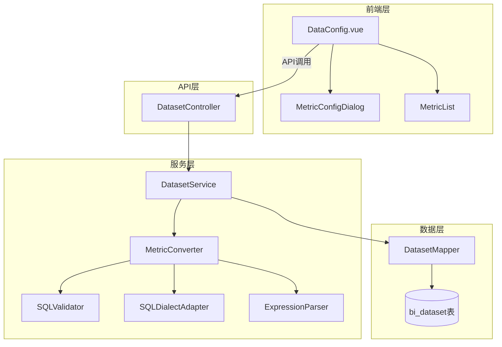

# 设计文档

## 概述

本设计文档描述了增强 DataConfig.vue 组件以支持计算指标配置的技术方案。该功能将使用户能够定义基础聚合指标和复杂的计算指标,用于金融分析场景,如不良贷款率、资本充足率等关键指标的计算。

### 设计目标

1. **安全性优先**: 实现全面的 SQL 注入防护机制
2. **性能保护**: 限制查询复杂度,防止系统资源耗尽
3. **数据库兼容**: 支持 MySQL、PostgreSQL、ClickHouse、Doris 等多种数据库
4. **用户友好**: 提供直观的 UI 界面和清晰的错误提示
5. **可扩展性**: 设计模块化架构,便于未来添加新的指标类型

### 核心功能

- **基础指标聚合**: SUM、AVG、COUNT、MAX、MIN
- **条件比率**: 基于条件的分子分母比率计算
- **简单比率**: 两个指标之间的直接比率
- **条件求和**: 基于条件的聚合计算
- **自定义表达式**: 支持复杂的数学表达式组合

## 架构

### 系统架构图



### 数据流

1. **配置阶段**: 用户配置 → 前端验证 → 后端安全验证 → 序列化存储
2. **执行阶段**: 加载配置 → SQL转换 → 方言适配 → 执行查询

## 组件和接口

### 后端核心组件

#### 1. MetricConfigDTO.java

指标配置的数据传输对象,包含:
- BaseMetric: 基础指标(字段+聚合函数)
- ComputedMetric: 计算指标(条件比率/简单比率/条件求和/自定义表达式)

#### 2. SQLValidator.java

SQL注入防护验证器,负责:
- 验证字段名格式
- 检查SQL关键字黑名单
- 检查SQL注释和终止符
- 验证条件表达式和数学表达式

关键方法:
- `validateFieldName(String)`: 验证字段名
- `validateCondition(String)`: 验证条件表达式
- `validateExpression(String)`: 验证数学表达式
- `validateAggregation(String)`: 验证聚合函数

#### 3. ExpressionParser.java

表达式解析器,负责:
- 提取指标引用
- 验证表达式语法
- 检查括号匹配
- 验证运算符位置

#### 4. MetricConverter.java

指标转换器,负责将指标配置转换为SQL:

```java
public class MetricConverter {
    // 基础指标: SUM(field) AS alias
    public String convertBaseMetric(BaseMetric metric);
    
    // 条件比率: SUM(CASE WHEN...) / NULLIF(SUM(CASE WHEN...), 0)
    public String convertConditionalRatio(ConditionalRatioMetric metric);
    
    // 简单比率: metric1 / NULLIF(metric2, 0)
    public String convertSimpleRatio(SimpleRatioMetric metric);
    
    // 条件求和: SUM(CASE WHEN condition THEN field ELSE 0 END)
    public String convertConditionalSum(ConditionalSumMetric metric);
    
    // 自定义表达式: 替换指标引用为SQL表达式
    public String convertCustomExpression(CustomExpressionMetric metric);
}
```

#### 5. SQLDialectAdapter.java

数据库方言适配器,支持:
- MySQL
- PostgreSQL  
- ClickHouse
- Doris

根据数据源类型生成对应的SQL语法。

### 前端核心组件

#### 1. DataConfig.vue (增强)

现有组件增强,添加:
- 指标配置选项卡(基础指标/计算指标)
- 指标列表管理
- 添加/编辑/删除指标功能

#### 2. MetricConfigDialog.vue (新增)

指标配置对话框,包含:
- 指标类型选择
- 动态表单(根据类型显示不同字段)
- SQL预览
- 测试功能
- 验证反馈

### API接口

#### 1. 验证接口

```
POST /api/bi/dataset/metric/validate
Request: MetricConfigDTO
Response: { valid: boolean, message: string }
```

#### 2. 测试接口

```
POST /api/bi/dataset/metric/test
Request: { datasetId: Long, metric: MetricConfig }
Response: { data: [], columns: [], duration: number }
```

#### 3. 保存接口

```
PUT /api/bi/dataset/{id}/config
Request: { metricConfig: MetricConfigDTO }
Response: AjaxResult
```

## 数据模型

### 数据库模式

指标配置存储在 `bi_dataset` 表的 `config` 字段中(JSON格式)。

```sql
CREATE TABLE bi_dataset (
    id BIGINT PRIMARY KEY AUTO_INCREMENT,
    name VARCHAR(100) NOT NULL,
    datasource_id BIGINT NOT NULL,
    query_type VARCHAR(20) NOT NULL,
    query_config TEXT,
    config TEXT COMMENT '数据集配置(JSON,包含指标配置)',
    create_time DATETIME DEFAULT CURRENT_TIMESTAMP,
    update_time DATETIME DEFAULT CURRENT_TIMESTAMP ON UPDATE CURRENT_TIMESTAMP
);
```

### JSON配置结构

```json
{
  "metricConfig": {
    "baseMetrics": [
      {
        "name": "total_loan_amount",
        "alias": "贷款总额",
        "field": "loan_amount",
        "aggregation": "SUM"
      }
    ],
    "computedMetrics": [
      {
        "name": "npl_ratio",
        "alias": "不良贷款率",
        "computeType": "conditional_ratio",
        "field": "loan_amount",
        "numeratorCondition": "loan_status = 'NPL'",
        "denominatorCondition": "loan_status IN ('NORMAL', 'NPL')",
        "asPercentage": true
      }
    ]
  }
}
```

## 正确性属性

*属性是一个特征或行为,应该在系统的所有有效执行中保持为真——本质上是关于系统应该做什么的形式化陈述。*

### 属性反思

经过分析,我将相似的验收标准合并为核心属性:

**合并策略**:
1. SQL注入防护(6.2-6.4) → 属性6
2. 条件验证(2.2, 2.3, 4.2) → 属性7
3. 除零保护(2.5, 3.4) → 已包含在属性2和3中
4. 数据库方言(7.2-7.4) → 属性9
5. 验证反馈(11.1-11.4) → 属性14
6. 配置持久化(9.1+9.3) → 属性10

### 核心属性

#### 属性 1: 基础指标SQL生成正确性

*对于任意*有效的基础指标配置(字段名和聚合函数),MetricConverter应该生成格式正确的SQL聚合表达式

**验证需求**: 1.4

#### 属性 2: 条件比率SQL生成正确性

*对于任意*有效的条件比率配置,MetricConverter应该生成包含CASE语句和NULLIF保护的SQL表达式

**验证需求**: 2.4, 2.5

#### 属性 3: 简单比率SQL生成正确性

*对于任意*两个有效的基础指标引用,MetricConverter应该生成包含NULLIF保护的除法表达式

**验证需求**: 3.3, 3.4

#### 属性 4: 条件求和SQL生成正确性

*对于任意*有效的条件求和配置,MetricConverter应该生成CASE语句表达式

**验证需求**: 4.3

#### 属性 5: 自定义表达式SQL生成正确性

*对于任意*有效的自定义表达式,MetricConverter应该将指标引用替换为对应的SQL表达式,并对除法添加NULLIF保护

**验证需求**: 5.5, 5.6

#### 属性 6: SQL注入防护

*对于任意*用户提供的字符串输入,SQLValidator应该拒绝包含危险模式的输入(SQL关键字/注释/终止符/非法字符)

**验证需求**: 6.2, 6.3, 6.4, 6.7

#### 属性 7: 条件表达式验证

*对于任意*条件表达式输入,SQLValidator应该验证其语法并拒绝包含SQL注入风险的表达式

**验证需求**: 2.2, 2.3, 4.2, 4.4

#### 属性 8: 数学表达式解析正确性

*对于任意*数学表达式,ExpressionParser应该正确提取指标引用、验证括号匹配、验证运算符位置

**验证需求**: 5.2, 5.3, 5.4

#### 属性 9: 数据库方言适配

*对于任意*指标配置和目标数据库类型,SQLDialectAdapter应该生成该数据库兼容的SQL语法

**验证需求**: 7.1, 7.2, 7.3, 7.4, 7.5

#### 属性 10: 配置持久化Round-trip

*对于任意*有效的指标配置,序列化为JSON后再反序列化,应该得到等价的配置对象

**验证需求**: 9.1, 9.3, 9.5

#### 属性 11: 指标依赖完整性

*对于任意*计算指标,如果它引用了基础指标,删除该基础指标时应该触发警告

**验证需求**: 10.7

#### 属性 12: 嵌套深度限制

*对于任意*计算指标配置,其依赖链的嵌套深度不应超过3层

**验证需求**: 8.4

#### 属性 13: 指标引用验证

*对于任意*引用其他指标的计算指标,所有被引用的指标必须在配置中存在

**验证需求**: 3.2, 5.4

#### 属性 14: 验证错误反馈

*对于任意*验证失败的配置,系统应该返回清晰的错误消息

**验证需求**: 6.5, 11.1, 11.2, 11.3, 11.4

#### 属性 15: 百分比显示转换

*对于任意*启用百分比显示的比率指标,在可视化层应该将结果乘以100

**验证需求**: 3.5

## 错误处理

### 错误类型

1. **验证错误**: 输入格式不符 → 400 Bad Request + 详细错误信息
2. **安全错误**: SQL注入尝试 → 403 Forbidden + 记录日志
3. **引用错误**: 引用不存在的指标 → 400 + 可用指标列表
4. **性能限制错误**: 超过阈值 → 警告或拒绝
5. **数据库兼容性错误**: 不支持的功能 → 400 + 建议替代方案
6. **执行错误**: SQL执行失败 → 500 + 错误详情(测试模式下显示SQL)

### 错误恢复机制

1. **配置回滚**: 保存失败时保留上一个有效配置
2. **部分保存**: 基础指标和计算指标分别验证
3. **自动修复建议**: 对常见错误提供修复选项

## 测试策略

### 双重测试方法

- **单元测试**: 特定示例、边界情况、错误条件
- **属性测试**: 通过随机输入验证通用属性(每个属性最少100次迭代)

### 测试库选择

- **后端**: JUnit 5 + jqwik
- **前端**: Jest + fast-check

### 测试覆盖范围

#### 后端测试

1. **SQLValidator**: 属性测试(SQL注入防护、条件验证) + 单元测试(特定注入模式)
2. **ExpressionParser**: 属性测试(表达式解析) + 单元测试(复杂嵌套)
3. **MetricConverter**: 属性测试(所有SQL生成类型) + 单元测试(金融指标示例)
4. **SQLDialectAdapter**: 属性测试(方言适配) + 单元测试(特定数据库语法)
5. **配置持久化**: 属性测试(Round-trip序列化)

#### 前端测试

1. **MetricConfigDialog**: 单元测试(表单验证、用户交互、错误显示)
2. **DataConfig.vue**: 单元测试(指标列表管理、依赖检查、UI状态)
3. **集成测试**: 端到端测试(完整配置流程、测试功能、错误处理)

### 属性测试示例

```java
@Property(tries = 100)
@Label("Feature: enhanced-data-config, Property 6: SQL注入防护")
void sqlInjectionPrevention(@ForAll("maliciousInputs") String input) {
    assertThrows(SecurityException.class, () -> {
        sqlValidator.validateCondition(input);
    });
}

@Provide
Arbitrary<String> maliciousInputs() {
    return Arbitraries.of(
        "'; DROP TABLE users--",
        "1' OR '1'='1",
        "admin'--",
        "1; DELETE FROM loans",
        "/* comment */ SELECT"
    );
}
```

### 安全测试

1. **SQL注入测试套件**: 使用OWASP测试用例
2. **模糊测试**: 随机输入测试健壮性
3. **渗透测试**: 尝试绕过验证机制
4. **日志审计**: 验证安全事件记录
