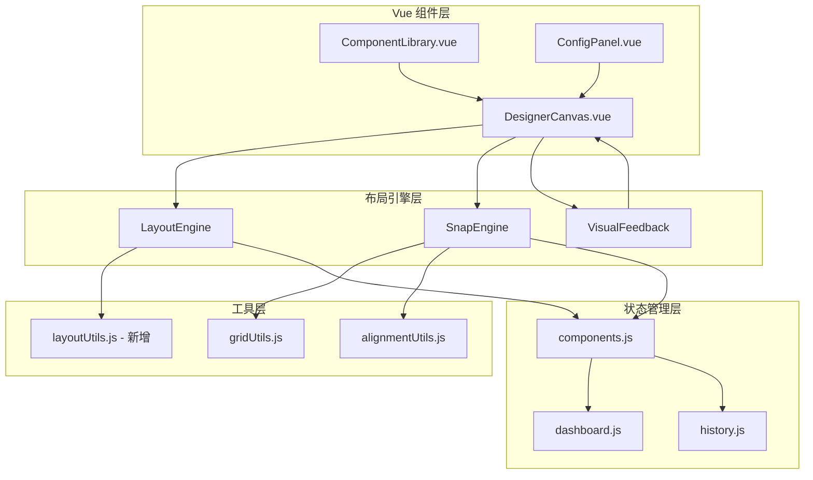

# 设计文档 - 智能画布布局系统

## 概述

智能画布布局系统为 IRAS Smart BI 仪表板设计器提供自动化的双列布局和智能吸附对齐功能。系统基于现有的 DesignerCanvas 组件、gridUtils 和 alignmentUtils 工具模块,通过增强和扩展现有功能来实现智能布局能力。

系统的核心设计理念是在自动化布局和手动调整自由度之间取得平衡,通过智能吸附算法引导用户创建整齐的布局,同时保留完全的自定义能力。

## 架构

### 系统架构图



### 架构说明

系统采用分层架构设计:

1. **Vue 组件层**: 用户交互界面,包括画布、组件库和配置面板
2. **布局引擎层**: 核心业务逻辑,处理布局计算、吸附和视觉反馈
3. **工具层**: 可复用的工具函数,处理网格、对齐和布局计算
4. **状态管理层**: Vuex store,管理组件状态、仪表板配置和历史记录

## 组件和接口

### 1. LayoutEngine (布局引擎)

布局引擎负责计算组件的自动布局位置。

```javascript
// ui/src/utils/layoutEngine.js

/**
 * 布局引擎类
 * 负责计算双列自动布局
 */
class LayoutEngine {
  constructor(config = {}) {
    this.config = {
      columnWidth: 760,
      rowHeight: 400,
      horizontalGap: 0,
      verticalGap: 0,
      canvasWidth: 1520,
      canvasHeight: 1080,
      ...config
    }
  }

  /**
   * 计算下一个可用位置(双列布局)
   * @param {Array} existingComponents - 现有组件列表
   * @param {Object} componentSize - 组件尺寸 {width, height}
   * @returns {Object} 位置 {x, y, row, column}
   */
  findNextAvailablePosition(existingComponents, componentSize) {
    const { columnWidth, rowHeight, horizontalGap, verticalGap } = this.config
    const columns = [0, columnWidth + horizontalGap]
    
    // 按行遍历
    for (let row = 0; row < 100; row++) {
      const y = row * (rowHeight + verticalGap)
      
      for (let col = 0; col < columns.length; col++) {
        const x = columns[col]
        const testArea = {
          x, y,
          width: componentSize.width || columnWidth,
          height: componentSize.height || rowHeight
        }
        
        // 检查是否与现有组件重叠
        if (!this.hasOverlap(testArea, existingComponents)) {
          return { x, y, row, column: col }
        }
      }
    }
    
    // 如果没有找到,返回最后一行
    const lastRow = Math.floor(existingComponents.length / 2)
    const lastCol = existingComponents.length % 2
    return {
      x: columns[lastCol],
      y: lastRow * (rowHeight + verticalGap),
      row: lastRow,
      column: lastCol
    }
  }

  /**
   * 检查区域是否与现有组件重叠
   */
  hasOverlap(area, components) {
    return components.some(comp => {
      const compArea = {
        x: comp.position.x,
        y: comp.position.y,
        width: comp.size.width,
        height: comp.size.height
      }
      return this.isOverlapping(area, compArea)
    })
  }

  /**
   * 检查两个区域是否重叠
   */
  isOverlapping(area1, area2) {
    return !(
      area1.x + area1.width <= area2.x ||
      area2.x + area2.width <= area1.x ||
      area1.y + area1.height <= area2.y ||
      area2.y + area2.height <= area1.y
    )
  }

  /**
   * 重新排列所有组件为双列布局
   * @param {Array} components - 组件列表
   * @returns {Array} 新的位置列表 [{id, position, size}]
   */
  rearrangeToTwoColumnLayout(components) {
    const { columnWidth, rowHeight, horizontalGap, verticalGap } = this.config
    const columns = [0, columnWidth + horizontalGap]
    
    return components.map((comp, index) => {
      const row = Math.floor(index / 2)
      const col = index % 2
      
      return {
        id: comp.id,
        position: {
          x: columns[col],
          y: row * (rowHeight + verticalGap)
        },
        size: {
          width: columnWidth,
          height: comp.size.height || rowHeight
        }
      }
    })
  }

  /**
   * 计算组件删除后的重新布局
   * @param {Array} remainingComponents - 剩余组件列表
   * @param {boolean} autoRearrange - 是否自动重排
   * @returns {Array} 新的位置列表
   */
  handleComponentDeletion(remainingComponents, autoRearrange = false) {
    if (!autoRearrange) {
      return [] // 不自动重排,保持原位置
    }
    return this.rearrangeToTwoColumnLayout(remainingComponents)
  }
}

export default LayoutEngine
```

### 2. SnapEngine (吸附引擎)

吸附引擎负责处理拖拽时的智能吸附。

```javascript
// ui/src/utils/snapEngine.js

/**
 * 吸附引擎类
 * 负责计算拖拽时的智能吸附
 */
class SnapEngine {
  constructor(config = {}) {
    this.config = {
      snapThreshold: 30, // 吸附阈值(像素)
      columnWidth: 760,
      rowHeight: 400,
      horizontalGap: 0,
      verticalGap: 0,
      enableGridSnap: true,
      enableComponentSnap: true,
      enableEdgeSnap: true,
      ...config
    }
  }

  /**
   * 计算吸附位置
   * @param {Object} position - 当前位置 {x, y}
   * @param {Object} size - 组件尺寸 {width, height}
   * @param {Array} otherComponents - 其他组件列表
   * @param {Object} options - 选项 {disableSnap}
   * @returns {Object} 吸附结果 {position, snapped, snapInfo, guides}
   */
  calculateSnap(position, size, otherComponents, options = {}) {
    if (options.disableSnap) {
      return {
        position,
        snapped: false,
        snapInfo: {},
        guides: []
      }
    }

    let snappedPos = { ...position }
    let snapped = false
    const snapInfo = {}
    const guides = []

    // 1. 网格吸附
    if (this.config.enableGridSnap) {
      const gridSnap = this.snapToGrid(position)
      if (gridSnap.snapped) {
        snappedPos = gridSnap.position
        snapped = true
        Object.assign(snapInfo, gridSnap.snapInfo)
        guides.push(...gridSnap.guides)
      }
    }

    // 2. 组件边缘吸附
    if (this.config.enableComponentSnap) {
      const compSnap = this.snapToComponents(snappedPos, size, otherComponents)
      if (compSnap.snapped) {
        snappedPos = compSnap.position
        snapped = true
        Object.assign(snapInfo, compSnap.snapInfo)
        guides.push(...compSnap.guides)
      }
    }

    // 3. 画布边缘吸附
    if (this.config.enableEdgeSnap) {
      const edgeSnap = this.snapToCanvasEdges(snappedPos, size)
      if (edgeSnap.snapped) {
        snappedPos = edgeSnap.position
        snapped = true
        Object.assign(snapInfo, edgeSnap.snapInfo)
      }
    }

    return {
      position: snappedPos,
      snapped,
      snapInfo,
      guides
    }
  }

  /**
   * 吸附到网格
   */
  snapToGrid(position) {
    const { snapThreshold, columnWidth, rowHeight, horizontalGap, verticalGap } = this.config
    const columns = [0, columnWidth + horizontalGap]
    
    let nearestColumn = columns[0]
    let minXDistance = Math.abs(position.x - columns[0])
    
    columns.forEach(col => {
      const distance = Math.abs(position.x - col)
      if (distance < minXDistance) {
        minXDistance = distance
        nearestColumn = col
      }
    })

    const row = Math.round(position.y / (rowHeight + verticalGap))
    const nearestRow = row * (rowHeight + verticalGap)
    const yDistance = Math.abs(position.y - nearestRow)

    const shouldSnapX = minXDistance < snapThreshold
    const shouldSnapY = yDistance < snapThreshold

    const guides = []
    if (shouldSnapX) {
      guides.push({
        type: 'vertical',
        position: nearestColumn,
        style: 'grid',
        id: `grid-x-${nearestColumn}`
      })
    }
    if (shouldSnapY) {
      guides.push({
        type: 'horizontal',
        position: nearestRow,
        style: 'grid',
        id: `grid-y-${nearestRow}`
      })
    }

    return {
      position: {
        x: shouldSnapX ? nearestColumn : position.x,
        y: shouldSnapY ? nearestRow : position.y
      },
      snapped: shouldSnapX || shouldSnapY,
      snapInfo: {
        xSnapped: shouldSnapX,
        ySnapped: shouldSnapY,
        column: shouldSnapX ? columns.indexOf(nearestColumn) : -1,
        row: shouldSnapY ? row : -1
      },
      guides
    }
  }

  /**
   * 吸附到其他组件
   */
  snapToComponents(position, size, otherComponents) {
    const { snapThreshold } = this.config
    const guides = []
    let snappedX = position.x
    let snappedY = position.y
    let xSnapped = false
    let ySnapped = false

    const movingEdges = {
      left: position.x,
      right: position.x + size.width,
      top: position.y,
      bottom: position.y + size.height,
      centerX: position.x + size.width / 2,
      centerY: position.y + size.height / 2
    }

    otherComponents.forEach(comp => {
      const compEdges = {
        left: comp.position.x,
        right: comp.position.x + comp.size.width,
        top: comp.position.y,
        bottom: comp.position.y + comp.size.height,
        centerX: comp.position.x + comp.size.width / 2,
        centerY: comp.position.y + comp.size.height / 2
      }

      // 检查水平对齐
      const xAlignments = [
        { edge: 'left', value: compEdges.left, offset: 0 },
        { edge: 'right', value: compEdges.right, offset: -size.width },
        { edge: 'centerX', value: compEdges.centerX, offset: -size.width / 2 }
      ]

      xAlignments.forEach(align => {
        const distance = Math.abs(movingEdges[align.edge] - align.value)
        if (distance < snapThreshold && !xSnapped) {
          snappedX = align.value + align.offset
          xSnapped = true
          guides.push({
            type: 'vertical',
            position: align.value,
            style: 'component',
            alignType: align.edge,
            id: `comp-x-${comp.id}-${align.edge}`
          })
        }
      })

      // 检查垂直对齐
      const yAlignments = [
        { edge: 'top', value: compEdges.top, offset: 0 },
        { edge: 'bottom', value: compEdges.bottom, offset: -size.height },
        { edge: 'centerY', value: compEdges.centerY, offset: -size.height / 2 }
      ]

      yAlignments.forEach(align => {
        const distance = Math.abs(movingEdges[align.edge] - align.value)
        if (distance < snapThreshold && !ySnapped) {
          snappedY = align.value + align.offset
          ySnapped = true
          guides.push({
            type: 'horizontal',
            position: align.value,
            style: 'component',
            alignType: align.edge,
            id: `comp-y-${comp.id}-${align.edge}`
          })
        }
      })
    })

    return {
      position: { x: snappedX, y: snappedY },
      snapped: xSnapped || ySnapped,
      snapInfo: { xSnapped, ySnapped },
      guides
    }
  }

  /**
   * 吸附到画布边缘
   */
  snapToCanvasEdges(position, size) {
    const { snapThreshold } = this.config
    const canvasWidth = this.config.canvasWidth || 1520
    const canvasHeight = this.config.canvasHeight || 1080

    let snappedX = position.x
    let snappedY = position.y
    let xSnapped = false
    let ySnapped = false

    // 左边缘
    if (Math.abs(position.x) < snapThreshold) {
      snappedX = 0
      xSnapped = true
    }

    // 右边缘
    if (Math.abs(position.x + size.width - canvasWidth) < snapThreshold) {
      snappedX = canvasWidth - size.width
      xSnapped = true
    }

    // 顶边缘
    if (Math.abs(position.y) < snapThreshold) {
      snappedY = 0
      ySnapped = true
    }

    // 底边缘
    if (Math.abs(position.y + size.height - canvasHeight) < snapThreshold) {
      snappedY = canvasHeight - size.height
      ySnapped = true
    }

    return {
      position: { x: snappedX, y: snappedY },
      snapped: xSnapped || ySnapped,
      snapInfo: { xSnapped, ySnapped }
    }
  }
}

export default SnapEngine
```


### 3. VisualFeedback (视觉反馈管理器)

视觉反馈管理器负责在拖拽过程中显示对齐线、高亮区域等视觉提示。

```javascript
// ui/src/utils/visualFeedback.js

/**
 * 视觉反馈管理器
 * 负责管理拖拽过程中的视觉提示
 */
class VisualFeedback {
  constructor() {
    this.guides = []
    this.highlightZones = []
    this.snapIndicators = []
  }

  /**
   * 更新对齐参考线
   * @param {Array} guides - 参考线列表
   */
  updateGuides(guides) {
    this.guides = guides.map(guide => ({
      ...guide,
      color: this.getGuideColor(guide.style),
      width: this.getGuideWidth(guide.style)
    }))
  }

  /**
   * 获取参考线颜色
   */
  getGuideColor(style) {
    const colors = {
      grid: '#409eff',      // 网格吸附 - 蓝色
      component: '#67c23a', // 组件对齐 - 绿色
      edge: '#e6a23c'       // 边缘吸附 - 橙色
    }
    return colors[style] || '#409eff'
  }

  /**
   * 获取参考线宽度
   */
  getGuideWidth(style) {
    const widths = {
      grid: 2,
      component: 1,
      edge: 1
    }
    return widths[style] || 1
  }

  /**
   * 显示吸附区域高亮
   * @param {Object} zone - 区域信息 {x, y, width, height, type}
   */
  showSnapZone(zone) {
    this.highlightZones.push({
      ...zone,
      opacity: 0.1,
      borderColor: '#409eff',
      borderWidth: 2
    })
  }

  /**
   * 清除所有视觉反馈
   */
  clear() {
    this.guides = []
    this.highlightZones = []
    this.snapIndicators = []
  }

  /**
   * 获取当前所有视觉反馈元素
   */
  getFeedbackElements() {
    return {
      guides: this.guides,
      highlightZones: this.highlightZones,
      snapIndicators: this.snapIndicators
    }
  }
}

export default VisualFeedback
```

### 4. layoutUtils.js (新增布局工具模块)

扩展现有的工具模块,添加布局相关的工具函数。

```javascript
// ui/src/utils/layoutUtils.js

/**
 * 布局工具函数
 * 提供布局计算和验证功能
 */

/**
 * 计算组件的网格位置
 * @param {Object} position - 像素位置 {x, y}
 * @param {Object} config - 网格配置
 * @returns {Object} 网格位置 {row, column}
 */
export function positionToGrid(position, config = {}) {
  const { columnWidth = 760, rowHeight = 400, horizontalGap = 0, verticalGap = 0 } = config
  
  const column = Math.round(position.x / (columnWidth + horizontalGap))
  const row = Math.round(position.y / (rowHeight + verticalGap))
  
  return { row, column }
}

/**
 * 将网格位置转换为像素位置
 * @param {Object} gridPos - 网格位置 {row, column}
 * @param {Object} config - 网格配置
 * @returns {Object} 像素位置 {x, y}
 */
export function gridToPosition(gridPos, config = {}) {
  const { columnWidth = 760, rowHeight = 400, horizontalGap = 0, verticalGap = 0 } = config
  
  const x = gridPos.column * (columnWidth + horizontalGap)
  const y = gridPos.row * (rowHeight + verticalGap)
  
  return { x, y }
}

/**
 * 验证组件位置是否有效
 * @param {Object} position - 位置 {x, y}
 * @param {Object} size - 尺寸 {width, height}
 * @param {Object} canvasSize - 画布尺寸 {width, height}
 * @returns {boolean} 是否有效
 */
export function isValidPosition(position, size, canvasSize) {
  return (
    position.x >= 0 &&
    position.y >= 0 &&
    position.x + size.width <= canvasSize.width &&
    position.y + size.height <= canvasSize.height
  )
}

/**
 * 计算组件间距
 * @param {Object} comp1 - 组件1
 * @param {Object} comp2 - 组件2
 * @returns {Object} 间距 {horizontal, vertical}
 */
export function calculateSpacing(comp1, comp2) {
  const horizontal = Math.min(
    Math.abs(comp1.position.x - (comp2.position.x + comp2.size.width)),
    Math.abs(comp2.position.x - (comp1.position.x + comp1.size.width))
  )
  
  const vertical = Math.min(
    Math.abs(comp1.position.y - (comp2.position.y + comp2.size.height)),
    Math.abs(comp2.position.y - (comp1.position.y + comp1.size.height))
  )
  
  return { horizontal, vertical }
}

/**
 * 检查布局模式
 * @param {Array} components - 组件列表
 * @param {Object} config - 配置
 * @returns {string} 布局模式 'two-column' | 'free' | 'mixed'
 */
export function detectLayoutMode(components, config = {}) {
  if (components.length === 0) return 'two-column'
  
  const { columnWidth = 760, horizontalGap = 0 } = config
  const columns = [0, columnWidth + horizontalGap]
  const tolerance = 20 // 容差范围
  
  let twoColumnCount = 0
  let freeCount = 0
  
  components.forEach(comp => {
    const isInColumn = columns.some(col => 
      Math.abs(comp.position.x - col) < tolerance
    )
    
    if (isInColumn) {
      twoColumnCount++
    } else {
      freeCount++
    }
  })
  
  if (freeCount === 0) return 'two-column'
  if (twoColumnCount === 0) return 'free'
  return 'mixed'
}

/**
 * 优化组件间距
 * @param {Array} components - 组件列表
 * @param {number} targetSpacing - 目标间距
 * @returns {Array} 优化后的位置列表
 */
export function optimizeSpacing(components, targetSpacing = 16) {
  // 按行分组
  const rows = groupByRow(components)
  const updates = []
  
  rows.forEach(row => {
    if (row.length < 2) return
    
    // 按X坐标排序
    row.sort((a, b) => a.position.x - b.position.x)
    
    // 调整间距
    for (let i = 1; i < row.length; i++) {
      const prev = row[i - 1]
      const curr = row[i]
      const expectedX = prev.position.x + prev.size.width + targetSpacing
      
      if (Math.abs(curr.position.x - expectedX) > 5) {
        updates.push({
          id: curr.id,
          position: { x: expectedX, y: curr.position.y }
        })
      }
    }
  })
  
  return updates
}

/**
 * 按行分组组件
 */
function groupByRow(components, tolerance = 50) {
  const rows = []
  
  components.forEach(comp => {
    let foundRow = false
    
    for (const row of rows) {
      if (Math.abs(row[0].position.y - comp.position.y) < tolerance) {
        row.push(comp)
        foundRow = true
        break
      }
    }
    
    if (!foundRow) {
      rows.push([comp])
    }
  })
  
  return rows
}

/**
 * 序列化布局配置
 * @param {Array} components - 组件列表
 * @param {Object} layoutConfig - 布局配置
 * @returns {Object} 序列化的配置
 */
export function serializeLayout(components, layoutConfig) {
  return {
    mode: layoutConfig.mode || 'two-column',
    config: {
      columnWidth: layoutConfig.columnWidth || 760,
      rowHeight: layoutConfig.rowHeight || 400,
      horizontalGap: layoutConfig.horizontalGap || 0,
      verticalGap: layoutConfig.verticalGap || 0
    },
    components: components.map(comp => ({
      id: comp.id,
      position: comp.position,
      size: comp.size,
      zIndex: comp.zIndex || 1
    }))
  }
}

/**
 * 反序列化布局配置
 * @param {Object} layoutData - 序列化的布局数据
 * @returns {Object} 布局配置和组件位置
 */
export function deserializeLayout(layoutData) {
  return {
    mode: layoutData.mode || 'two-column',
    config: layoutData.config || {},
    componentPositions: layoutData.components || []
  }
}
```

## 数据模型

### 布局配置模型

```javascript
// 布局配置
const LayoutConfig = {
  mode: 'two-column',        // 布局模式: 'two-column' | 'free'
  columnWidth: 760,          // 列宽(像素)
  rowHeight: 400,            // 行高(像素)
  horizontalGap: 0,          // 水平间距(像素)
  verticalGap: 0,            // 垂直间距(像素)
  canvasWidth: 1520,         // 画布宽度
  canvasHeight: 1080,        // 画布高度
  snapThreshold: 30,         // 吸附阈值(像素)
  enableGridSnap: true,      // 启用网格吸附
  enableComponentSnap: true, // 启用组件吸附
  enableEdgeSnap: true,      // 启用边缘吸附
  autoRearrangeOnDelete: false // 删除时自动重排
}
```

### 组件位置模型

```javascript
// 组件位置和尺寸
const ComponentPosition = {
  id: 'comp_1',              // 组件ID
  position: {
    x: 0,                    // X坐标(像素)
    y: 0                     // Y坐标(像素)
  },
  size: {
    width: 760,              // 宽度(像素)
    height: 400              // 高度(像素)
  },
  zIndex: 1,                 // 层级
  gridPosition: {            // 网格位置(可选)
    row: 0,
    column: 0
  }
}
```

### 吸附结果模型

```javascript
// 吸附计算结果
const SnapResult = {
  position: { x: 0, y: 0 },  // 吸附后的位置
  snapped: true,             // 是否发生了吸附
  snapInfo: {
    xSnapped: true,          // X轴是否吸附
    ySnapped: false,         // Y轴是否吸附
    column: 0,               // 吸附到的列(-1表示未吸附)
    row: 0                   // 吸附到的行(-1表示未吸附)
  },
  guides: [                  // 对齐参考线
    {
      type: 'vertical',      // 'vertical' | 'horizontal'
      position: 0,           // 参考线位置
      style: 'grid',         // 'grid' | 'component' | 'edge'
      alignType: 'left',     // 对齐类型
      id: 'guide_1'          // 唯一标识
    }
  ]
}
```

### 视觉反馈模型

```javascript
// 视觉反馈元素
const VisualFeedbackElements = {
  guides: [                  // 对齐参考线
    {
      type: 'vertical',
      position: 0,
      color: '#409eff',
      width: 2,
      id: 'guide_1'
    }
  ],
  highlightZones: [          // 高亮区域
    {
      x: 0,
      y: 0,
      width: 760,
      height: 400,
      opacity: 0.1,
      borderColor: '#409eff',
      borderWidth: 2
    }
  ],
  snapIndicators: []         // 吸附指示器
}
```

## 正确性属性

*属性是一个特征或行为,应该在系统的所有有效执行中保持为真——本质上是关于系统应该做什么的形式化陈述。属性作为人类可读规范和机器可验证正确性保证之间的桥梁。*


### 双列布局属性

**属性 1: 新组件自动定位**
*对于任意*现有组件列表和新组件,当添加新组件时,布局引擎应该将其放置在下一个可用的双列网格位置(按行优先顺序:第0行第0列、第0行第1列、第1行第0列、第1行第1列...)
**验证需求: 1.1, 1.2, 1.3**

**属性 2: 组件宽度一致性**
*对于任意*双列布局模式下的组件列表,所有组件的宽度应该等于配置的columnWidth值
**验证需求: 1.5**

**属性 3: 组件间距一致性**
*对于任意*自动排列的组件列表,同行相邻组件之间的水平间距应该等于配置的horizontalGap值,相邻行之间的垂直间距应该等于配置的verticalGap值
**验证需求: 1.6, 3.1, 3.2, 3.3**

**属性 4: 删除后重排(可选)**
*对于任意*组件列表,当删除一个组件且autoRearrangeOnDelete为true时,剩余组件应该重新排列以填补空缺,保持双列布局顺序
**验证需求: 1.4**

### 智能吸附属性

**属性 5: 网格吸附阈值**
*对于任意*位置,当该位置与网格线的距离小于snapThreshold时,吸附引擎应该将其吸附到最近的网格线;当距离大于或等于snapThreshold时,不应该吸附
**验证需求: 2.1, 2.7**

**属性 6: 组件边缘吸附**
*对于任意*拖拽位置和现有组件列表,当拖拽组件的边缘与任何现有组件的边缘距离小于snapThreshold时,应该吸附到该边缘
**验证需求: 2.2**

**属性 7: 对齐功能完整性**
*对于任意*组件和目标组件,吸附引擎应该支持所有六种对齐类型:左对齐、右对齐、水平居中对齐、顶部对齐、底部对齐、垂直居中对齐
**验证需求: 2.4, 2.5**

**属性 8: 吸附禁用选项**
*对于任意*位置,当disableSnap选项为true时,吸附引擎应该返回原始位置而不进行任何吸附调整
**验证需求: 2.6**

**属性 9: 吸附时显示参考线**
*对于任意*吸附操作,当snapped为true时,返回的guides数组应该包含至少一条参考线;当snapped为false时,guides数组应该为空
**验证需求: 2.3, 4.2, 4.3**

### 视觉反馈属性

**属性 10: 参考线颜色区分**
*对于任意*参考线列表,网格吸附参考线(style='grid')、组件对齐参考线(style='component')和边缘吸附参考线(style='edge')应该具有不同的颜色值
**验证需求: 4.5**

### 响应式布局属性

**属性 11: 组件顺序保持**
*对于任意*组件列表,当画布尺寸改变时,组件的相对顺序(按position.y然后position.x排序)应该保持不变
**验证需求: 5.2**

**属性 12: 布局模式自适应**
*对于任意*画布宽度,当宽度小于单列最小宽度阈值时,应该切换到单列布局;当宽度恢复到足够容纳双列时,应该恢复双列布局
**验证需求: 5.4, 5.5**

### 不同尺寸组件属性

**属性 13: 支持不同高度**
*对于任意*高度值,布局引擎应该正确处理具有不同高度的组件,将它们放置在正确的网格位置而不尝试填充高度差异
**验证需求: 6.1, 6.2**

**属性 14: 调整高度不影响其他组件**
*对于任意*组件,当调整其高度时,其他组件的position值应该保持不变
**验证需求: 6.4**

### 手动调整自由度属性

**属性 15: 手动移动不触发重排**
*对于任意*组件,当手动移动其位置时,其他组件的position值应该保持不变(除非显式调用重排函数)
**验证需求: 7.2**

**属性 16: 混合模式下新组件定位**
*对于任意*混合布局模式(既有自动排列又有手动调整的组件)的组件列表,添加新组件时应该将其放置在所有现有组件的最大Y坐标之下
**验证需求: 7.4**

### 配置和持久化属性

**属性 17: 序列化完整性**
*对于任意*组件列表和布局配置,序列化结果应该包含mode、config对象(包含columnWidth、rowHeight、horizontalGap、verticalGap)以及所有组件的id、position、size和zIndex信息
**验证需求: 10.1, 10.2, 10.3, 10.4**

**属性 18: 序列化往返一致性**
*对于任意*布局配置和组件列表,序列化然后反序列化应该得到等价的配置和组件位置数据
**验证需求: 7.6, 10.5**

## 错误处理

### 错误场景和处理策略

1. **无效位置输入**
   - 场景: 组件位置超出画布范围
   - 处理: 使用constrainToCanvas函数将组件限制在画布范围内
   - 用户反馈: 控制台警告,组件自动调整到有效位置

2. **组件重叠**
   - 场景: 手动放置导致组件重叠
   - 处理: 允许重叠(自由布局模式),或提供"优化布局"功能消除重叠
   - 用户反馈: 视觉上显示重叠,提供优化建议

3. **画布空间不足**
   - 场景: 添加组件时画布已满
   - 处理: 将组件放置在最后位置,可能超出可见区域
   - 用户反馈: 显示警告消息"画布空间不足,组件可能重叠"

4. **无效配置值**
   - 场景: columnWidth、rowHeight等配置值为负数或零
   - 处理: 使用默认值替代无效配置
   - 用户反馈: 控制台错误,使用默认配置

5. **序列化/反序列化失败**
   - 场景: JSON格式错误或数据不完整
   - 处理: 捕获异常,返回空配置或默认配置
   - 用户反馈: 错误提示"加载布局配置失败,使用默认布局"

6. **性能降级**
   - 场景: 组件数量超过性能阈值(>50个)
   - 处理: 禁用某些视觉反馈效果,使用防抖优化
   - 用户反馈: 提示"组件较多,部分视觉效果已禁用以提升性能"

### 错误处理实现

```javascript
// 错误处理工具函数
export function handleLayoutError(error, context) {
  console.error(`[LayoutEngine] Error in ${context}:`, error)
  
  // 根据错误类型返回默认值或采取恢复措施
  switch (error.type) {
    case 'INVALID_POSITION':
      return { x: 0, y: 0 }
    case 'INVALID_CONFIG':
      return getDefaultConfig()
    case 'SERIALIZATION_ERROR':
      return null
    default:
      throw error
  }
}

// 配置验证
export function validateConfig(config) {
  const errors = []
  
  if (config.columnWidth <= 0) {
    errors.push('columnWidth must be positive')
  }
  if (config.rowHeight <= 0) {
    errors.push('rowHeight must be positive')
  }
  if (config.snapThreshold < 0) {
    errors.push('snapThreshold must be non-negative')
  }
  
  return {
    valid: errors.length === 0,
    errors
  }
}

// 位置约束
export function constrainPosition(position, size, canvasSize) {
  return {
    x: Math.max(0, Math.min(position.x, canvasSize.width - size.width)),
    y: Math.max(0, Math.min(position.y, canvasSize.height - size.height))
  }
}
```

## 测试策略

### 测试方法

系统采用双重测试策略:

1. **单元测试**: 验证具体示例、边缘情况和错误条件
2. **属性测试**: 验证跨所有输入的通用属性

两种测试方法是互补的,共同提供全面的覆盖。

### 单元测试重点

单元测试应该关注:
- 具体示例: 演示正确行为的特定场景
- 边缘情况: 空组件列表、单个组件、画布边界等
- 错误条件: 无效输入、配置错误、超出范围等
- 集成点: 与Vuex store、历史管理器的交互

避免编写过多单元测试 - 属性测试已经处理了大量输入覆盖。

### 属性测试配置

**测试库选择**: 使用 fast-check (JavaScript属性测试库)

**配置要求**:
- 每个属性测试最少运行 100 次迭代(由于随机化)
- 每个测试必须引用其设计文档属性
- 标签格式: `Feature: smart-canvas-layout, Property {number}: {property_text}`

**属性测试示例**:

```javascript
// tests/unit/layoutEngine.spec.js
import fc from 'fast-check'
import LayoutEngine from '@/utils/layoutEngine'

describe('LayoutEngine - Property Tests', () => {
  // Feature: smart-canvas-layout, Property 1: 新组件自动定位
  it('should place new components in next available two-column position', () => {
    fc.assert(
      fc.property(
        fc.array(componentArbitrary(), { maxLength: 20 }),
        fc.record({ width: fc.integer(100, 800), height: fc.integer(100, 600) }),
        (existingComponents, newComponentSize) => {
          const engine = new LayoutEngine()
          const position = engine.findNextAvailablePosition(
            existingComponents,
            newComponentSize
          )
          
          // 验证位置在有效的列中(0或760)
          expect([0, 760]).toContain(position.x)
          
          // 验证位置不与现有组件重叠
          const hasOverlap = existingComponents.some(comp =>
            engine.isOverlapping(
              { ...position, ...newComponentSize },
              { ...comp.position, ...comp.size }
            )
          )
          expect(hasOverlap).toBe(false)
        }
      ),
      { numRuns: 100 }
    )
  })

  // Feature: smart-canvas-layout, Property 2: 组件宽度一致性
  it('should maintain consistent component width in two-column layout', () => {
    fc.assert(
      fc.property(
        fc.array(componentArbitrary(), { minLength: 1, maxLength: 20 }),
        (components) => {
          const engine = new LayoutEngine({ columnWidth: 760 })
          const arranged = engine.rearrangeToTwoColumnLayout(components)
          
          // 所有组件宽度应该等于columnWidth
          arranged.forEach(comp => {
            expect(comp.size.width).toBe(760)
          })
        }
      ),
      { numRuns: 100 }
    )
  })

  // Feature: smart-canvas-layout, Property 5: 网格吸附阈值
  it('should snap to grid only within threshold distance', () => {
    fc.assert(
      fc.property(
        fc.record({
          x: fc.integer(0, 1520),
          y: fc.integer(0, 1080)
        }),
        (position) => {
          const engine = new SnapEngine({ snapThreshold: 30 })
          const result = engine.snapToGrid(position)
          
          const nearestGridX = Math.round(position.x / 760) * 760
          const nearestGridY = Math.round(position.y / 400) * 400
          const distanceX = Math.abs(position.x - nearestGridX)
          const distanceY = Math.abs(position.y - nearestGridY)
          
          // 如果在阈值内,应该吸附
          if (distanceX < 30) {
            expect(result.position.x).toBe(nearestGridX)
            expect(result.snapInfo.xSnapped).toBe(true)
          } else {
            expect(result.position.x).toBe(position.x)
            expect(result.snapInfo.xSnapped).toBe(false)
          }
          
          if (distanceY < 30) {
            expect(result.position.y).toBe(nearestGridY)
            expect(result.snapInfo.ySnapped).toBe(true)
          } else {
            expect(result.position.y).toBe(position.y)
            expect(result.snapInfo.ySnapped).toBe(false)
          }
        }
      ),
      { numRuns: 100 }
    )
  })

  // Feature: smart-canvas-layout, Property 18: 序列化往返一致性
  it('should maintain data consistency through serialize-deserialize cycle', () => {
    fc.assert(
      fc.property(
        fc.array(componentArbitrary(), { maxLength: 10 }),
        layoutConfigArbitrary(),
        (components, config) => {
          const serialized = serializeLayout(components, config)
          const deserialized = deserializeLayout(serialized)
          
          // 验证配置一致
          expect(deserialized.mode).toBe(config.mode)
          expect(deserialized.config).toEqual(config)
          
          // 验证组件位置一致
          deserialized.componentPositions.forEach((pos, index) => {
            expect(pos.id).toBe(components[index].id)
            expect(pos.position).toEqual(components[index].position)
            expect(pos.size).toEqual(components[index].size)
          })
        }
      ),
      { numRuns: 100 }
    )
  })
})

// 测试数据生成器
function componentArbitrary() {
  return fc.record({
    id: fc.string({ minLength: 5, maxLength: 10 }),
    position: fc.record({
      x: fc.integer(0, 1520),
      y: fc.integer(0, 1080)
    }),
    size: fc.record({
      width: fc.integer(100, 800),
      height: fc.integer(100, 600)
    }),
    zIndex: fc.integer(1, 100)
  })
}

function layoutConfigArbitrary() {
  return fc.record({
    mode: fc.constantFrom('two-column', 'free'),
    columnWidth: fc.integer(400, 1000),
    rowHeight: fc.integer(200, 600),
    horizontalGap: fc.integer(0, 50),
    verticalGap: fc.integer(0, 50)
  })
}
```

### 单元测试示例

```javascript
// tests/unit/layoutEngine.unit.spec.js
describe('LayoutEngine - Unit Tests', () => {
  it('should handle empty component list', () => {
    const engine = new LayoutEngine()
    const position = engine.findNextAvailablePosition([], { width: 760, height: 400 })
    
    expect(position).toEqual({ x: 0, y: 0, row: 0, column: 0 })
  })

  it('should place second component in second column', () => {
    const engine = new LayoutEngine()
    const existing = [{
      id: 'comp1',
      position: { x: 0, y: 0 },
      size: { width: 760, height: 400 }
    }]
    
    const position = engine.findNextAvailablePosition(existing, { width: 760, height: 400 })
    
    expect(position).toEqual({ x: 760, y: 0, row: 0, column: 1 })
  })

  it('should clear all visual feedback on clear()', () => {
    const feedback = new VisualFeedback()
    feedback.updateGuides([{ type: 'vertical', position: 100 }])
    feedback.showSnapZone({ x: 0, y: 0, width: 760, height: 400 })
    
    feedback.clear()
    
    expect(feedback.guides).toEqual([])
    expect(feedback.highlightZones).toEqual([])
    expect(feedback.snapIndicators).toEqual([])
  })

  it('should handle invalid config by using defaults', () => {
    const validation = validateConfig({ columnWidth: -100, rowHeight: 0 })
    
    expect(validation.valid).toBe(false)
    expect(validation.errors).toContain('columnWidth must be positive')
    expect(validation.errors).toContain('rowHeight must be positive')
  })
})
```

### 集成测试

集成测试验证组件与Vuex store、历史管理器的交互:

```javascript
// tests/integration/designerCanvas.spec.js
describe('DesignerCanvas Integration', () => {
  it('should update Vuex store when component is moved', async () => {
    const wrapper = mount(DesignerCanvas, {
      store,
      propsData: {
        components: [testComponent]
      }
    })
    
    // 模拟拖拽
    await wrapper.vm.handleComponentMouseDown(mockEvent, testComponent)
    await wrapper.vm.handleComponentMouseMove(mockMoveEvent)
    await wrapper.vm.handleComponentMouseUp()
    
    // 验证store更新
    expect(store.state.components.components[0].position).toEqual(expectedPosition)
  })

  it('should add history entry when layout changes', async () => {
    // 测试撤销/重做功能
  })
})
```

### 测试覆盖目标

- 单元测试: 覆盖所有公共函数和边缘情况
- 属性测试: 覆盖所有18个正确性属性
- 集成测试: 覆盖与Vuex、历史管理器的关键交互
- 总体代码覆盖率目标: >85%
